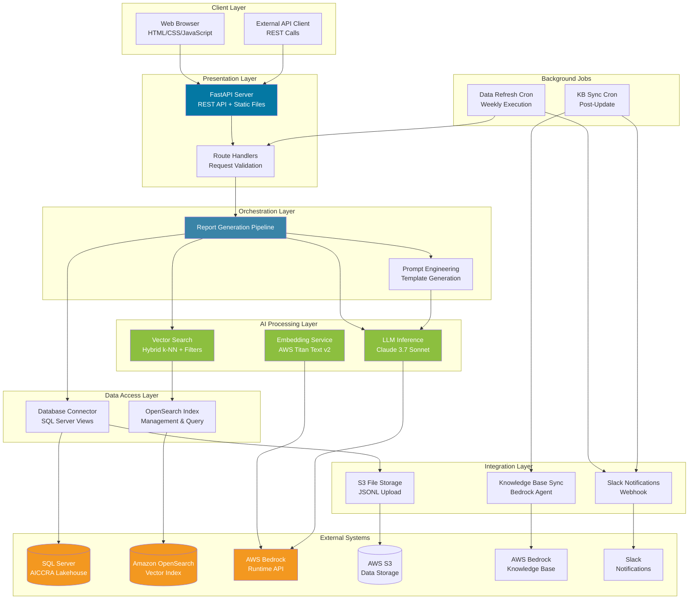
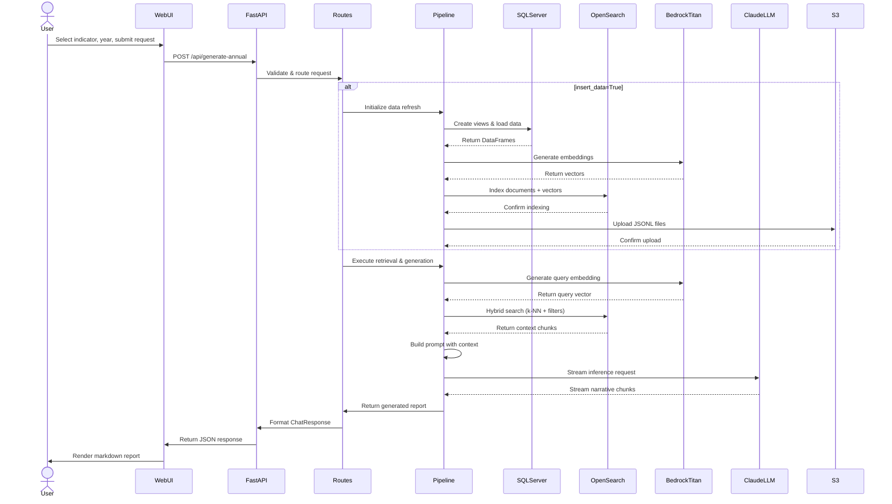

## High-Level Software Design Document
### AICCRA Annual Report Generator Service

**Module**: AI Module within MARLO Platform  
**Organization**: CGIAR AICCRA  
**Document Version**: 1.0  
**Last Updated**: February 2026

---

### 1. Purpose & Scope

#### 1.1 Purpose

The AICCRA Annual Report Generator Service is an AI-powered REST API service that automates the generation of comprehensive annual and mid-year progress reports for AICCRA (Accelerating Impacts of CGIAR Climate Research for Africa). The service produces high-quality, data-driven narrative reports for submission to the World Bank and other stakeholders, replacing manual report writing processes that previously required significant time and effort.

The service leverages Large Language Models (LLMs) and vector search technologies to synthesize complex project data, performance indicators, deliverables, and cluster contributions into structured, evidence-based narratives. This automation enables faster reporting cycles, improved consistency, and better data integration across the AICCRA ecosystem.

#### 1.2 Primary Functions

- **Automated Report Generation**: Creates Mid-Year Progress Reports and comprehensive Annual Reports for specific AICCRA performance indicators
- **Multi-Report Type Support**: Generates four distinct report types including progress reports, annual assessments, challenges analyses, and indicator summary tables
- **AI-Driven Narrative Synthesis**: Transforms structured data from databases and vector stores into coherent, contextually relevant narratives
- **Data Integration and Vectorization**: Synchronizes data from SQL Server databases into vector search indexes for efficient context retrieval
- **Web and API Access**: Provides both programmatic REST API endpoints and a user-friendly web interface

#### 1.3 Scope

**In Scope:**
- Generation of Mid-Year Progress Reports for AICCRA indicators (IPI 1.1-3.4, PDO 1-5)
- Generation of comprehensive Annual Reports with complete yearly assessments
- Generation of Challenges and Lessons Learned cross-cluster analyses
- Generation of Annual Indicator Summary Tables with quantitative overviews
- Data extraction from SQL Server (AICCRA Lakehouse)
- Data vectorization and indexing in Amazon OpenSearch Service
- AI-powered narrative generation using AWS Bedrock (Claude 3.7 Sonnet)
- REST API endpoints with OpenAPI documentation
- Web-based user interface for non-technical users
- Background data refresh processes via scheduled cron jobs
- AWS Lambda deployment capability

**Out of Scope:**
- Direct data entry or modification of source AICCRA data
- Report approval workflows and stakeholder review processes
- Report versioning and historical comparison features
- Real-time collaborative editing capabilities
- Integration with external document management systems beyond S3
- User authentication and role-based access control (currently relies on AWS IAM)
- Multi-language report generation (English only)
- Custom report templates beyond the four predefined types

---

### 2. System Overview

The AICCRA Annual Report Generator Service is a **microservice** deployed as a REST API that operates as a specialized module within the broader MARLO (Managing Agricultural Research for Learning and Outcomes) platform ecosystem. It functions as a standalone service with defined integration points to MARLO's data infrastructure.

#### 2.1 Service Classification

- **Architecture Pattern**: Microservice with REST API interface
- **Deployment Model**: Containerizable Python application deployable to AWS Lambda (via Mangum handler) or traditional server environments (via Uvicorn)
- **Operational Mode**: Primarily request-response synchronous processing with background job capabilities for data refresh operations

#### 2.2 Core Responsibilities

1. **Data Orchestration**: Retrieves structured project data from SQL Server databases, creates database views dynamically, and transforms data into vector embeddings
2. **Context Retrieval**: Performs hybrid search operations (vector similarity + keyword filtering) against OpenSearch indexes to retrieve relevant context for report generation
3. **AI-Powered Generation**: Constructs specialized prompts and invokes AWS Bedrock Claude 3.7 Sonnet to generate narrative content
4. **Report Assembly**: Combines quantitative summaries, AI-generated narratives, and structured data into formatted markdown reports
5. **Data Synchronization**: Executes scheduled background jobs to refresh vector indexes and synchronize AWS Bedrock Knowledge Base

#### 2.3 Technical Approach

The service employs a **hybrid AI approach** combining:

- **Vector Search Retrieval**: Uses Amazon OpenSearch Service with k-NN (k-Nearest Neighbors) vector search and HNSW (Hierarchical Navigable Small World) indexing to find contextually relevant information
- **Structured Data Filtering**: Applies precise database filters based on indicator acronyms, years, and data source tables
- **LLM-Based Generation**: Leverages Claude 3.7 Sonnet with carefully engineered prompts to produce coherent narratives that follow AICCRA reporting standards
- **Template-Driven Prompts**: Uses predefined prompt templates that structure the LLM's output according to World Bank reporting requirements

The service is **stateless** at the API request level, with state maintained externally in SQL Server databases and OpenSearch indexes. This design enables horizontal scalability and simplified deployment patterns.

---

### 3. High-Level Architecture

#### 3.1 Architecture Summary

The AICCRA Annual Report Generator Service follows a **layered microservice architecture** with clear separation of concerns across presentation, orchestration, AI processing, data access, and integration layers.

**Architectural Style**: Hybrid layered microservice with event-driven background processing

**Key Architectural Principles**:
- **Separation of Concerns**: Clear boundaries between API handling, business logic, AI processing, and data access
- **External State Management**: Stateless service design with state housed in external databases and vector stores
- **Lazy Initialization**: Services and configurations loaded on-demand to optimize cold start performance
- **Asynchronous Background Processing**: Long-running data refresh operations executed via scheduled cron jobs

**Primary Layers**:

1. **Presentation Layer** (Web + API)
   - REST API endpoints via FastAPI framework
   - Static web UI served from mounted directory
   - OpenAPI documentation and schema validation

2. **Orchestration Layer** (Routes + Pipeline)
   - API route handlers with request validation
   - Pipeline orchestrators that coordinate data retrieval, vectorization, and report generation
   - Error handling and response formatting

3. **AI Processing Layer** (LLM + Vector Search)
   - Vector embedding generation using AWS Bedrock Titan
   - Context retrieval via OpenSearch hybrid search
   - Report generation via Claude 3.7 Sonnet
   - Prompt engineering templates

4. **Data Access Layer** (Database + Vector Store)
   - SQL Server connectivity for structured data
   - OpenSearch index management and querying
   - Dynamic view creation for data transformation

5. **Integration Layer** (AWS Services + External Systems)
   - AWS Bedrock runtime integration
   - AWS S3 for file storage
   - AWS Bedrock Knowledge Base synchronization
   - Slack notifications for operational alerts

#### 3.2 Core Components

##### 3.2.1 API Server (`app/api/`)

**Responsibilities**:
- Expose REST endpoints for report generation requests
- Validate incoming requests using Pydantic models
- Serve static web UI files
- Provide health check and service metadata endpoints
- Handle CORS policies for cross-origin requests

**Interactions**:
- Receives HTTP requests from clients (web UI or external systems)
- Routes requests to appropriate pipeline orchestrators
- Returns JSON responses with generated reports or error details

**State**: Stateless

**Key Files**: [main.py](app/api/main.py), [routes.py](app/api/routes.py), [models.py](app/api/models.py)

##### 3.2.2 LLM Integration Service (`app/llm/`)

**Responsibilities**:
- Generate vector embeddings for text chunks using Amazon Titan model
- Invoke Claude 3.7 Sonnet with streaming response handling
- Manage OpenSearch index lifecycle (create, populate, query)
- Execute hybrid search queries combining vector similarity and metadata filters
- Orchestrate end-to-end report generation pipelines

**Interactions**:
- Communicates with AWS Bedrock runtime API for embeddings and LLM inference
- Queries and indexes data in Amazon OpenSearch Service
- Retrieves structured data from database connection layer
- Applies prompt templates from utilities layer

**State**: Stateless (maintains no session information)

**Key Files**: [invoke_llm.py](app/llm/invoke_llm.py), [vectorize_os.py](app/llm/vectorize_os.py), [vectorize_os_annual.py](app/llm/vectorize_os_annual.py)

##### 3.2.3 Database Connection Layer (`db_conn/`)

**Responsibilities**:
- Establish authenticated connections to SQL Server using Active Directory Service Principal
- Dynamically create or alter database views for data transformation
- Load structured data from pre-defined views into Pandas DataFrames
- Preprocess and clean data for vectorization
- Upload processed data to S3 in JSONL format

**Interactions**:
- Connects to SQL Server Lakehouse containing AICCRA operational data
- Provides data to LLM integration layer for vectorization
- Uploads processed datasets to AWS S3 for Knowledge Base ingestion

**State**: Stateless (creates new connections per request)

**Key Files**: [sql_connection.py](db_conn/sql_connection.py)

##### 3.2.4 Configuration Management (`app/utils/config/`)

**Responsibilities**:
- Load environment variables from `.env` file
- Provide centralized configuration dictionaries for AWS services, databases, and external integrations
- Maintain configuration for Bedrock, S3, OpenSearch, SQL Server, and Knowledge Base

**Interactions**:
- Used by all service components requiring credentials or service endpoints

**State**: Stateful (loads configuration at module import time)

**Key Files**: [config_util.py](app/utils/config/config_util.py)

##### 3.2.5 Prompt Engineering Templates (`app/utils/prompts/`)

**Responsibilities**:
- Generate structured prompts for different report types
- Define expected output formats and data handling instructions for the LLM
- Incorporate dynamic parameters (indicator, year, quantitative summaries)
- Enforce AICCRA reporting standards and formatting requirements

**Interactions**:
- Called by LLM pipeline orchestrators before invoking the model
- Returns formatted prompt strings

**State**: Stateless (pure functions)

**Key Files**: [annual_report_prompt.py](app/utils/prompts/annual_report_prompt.py), [report_prompt.py](app/utils/prompts/report_prompt.py), [challenges_prompt.py](app/utils/prompts/challenges_prompt.py), [diss_targets_prompt.py](app/utils/prompts/diss_targets_prompt.py)

##### 3.2.6 Logging Service (`app/utils/logger/`)

**Responsibilities**:
- Provide centralized logging with console and file output
- Implement log rotation to manage disk usage
- Format log entries with timestamps, severity levels, and source locations

**Interactions**:
- Used across all components for operational logging

**State**: Stateful (maintains file handles and rotation state)

**Key Files**: [logger_util.py](app/utils/logger/logger_util.py)

##### 3.2.7 Background Job Scheduler (`app/utils/cronjob/`)

**Responsibilities**:
- Install and manage cron jobs for weekly data refresh operations
- Execute data refresh requests to update OpenSearch vector indexes
- Trigger AWS Bedrock Knowledge Base synchronization after data updates
- Send Slack notifications on job completion or failure

**Interactions**:
- Makes HTTP POST requests to the service's own API endpoints
- Interacts with AWS Bedrock Agent service to start ingestion jobs
- Sends notifications via Slack webhooks

**State**: Stateless (executes as one-off scripts)

**Key Files**: [setup_cron.py](app/utils/cronjob/setup_cron.py), [update_ar_data.py](app/utils/cronjob/update_ar_data.py), [sync_knowledge_base.py](app/utils/cronjob/sync_knowledge_base.py)

##### 3.2.8 S3 Integration (`app/utils/s3/`)

**Responsibilities**:
- Upload processed JSONL files to S3 buckets
- Split large JSONL files into smaller chunks for Knowledge Base ingestion
- Check for file existence before upload operations

**Interactions**:
- Writes to AWS S3 buckets designated for Knowledge Base data sources
- Triggered by database connection layer after data export

**State**: Stateless

**Key Files**: [upload_file_to_s3.py](app/utils/s3/upload_file_to_s3.py), [divide_jsonl_files.py](app/utils/s3/divide_jsonl_files.py)

##### 3.2.9 Notification Service (`app/utils/notification/`)

**Responsibilities**:
- Send formatted notifications to Slack channels
- Report job completion status, errors, and operational metrics

**Interactions**:
- Called by cron jobs after significant operations
- Posts messages to Slack via webhook URLs

**State**: Stateless

**Key Files**: [notification_service.py](app/utils/notification/notification_service.py)

##### 3.2.10 Web User Interface (`web/`)

**Responsibilities**:
- Provide browser-based interface for non-technical users
- Present forms for indicator and year selection
- Display generated reports with markdown rendering
- Offer tabbed navigation for different report types

**Interactions**:
- Makes AJAX requests to API endpoints
- Renders JSON responses in the browser

**State**: Client-side only (no server-side state)

**Key Files**: [index.html](web/index.html), [app.js](web/app.js)

---

### 4. Architecture Diagram

---

### 5. Data Flow

#### 5.1 Standard Report Generation Flow

The following describes the step-by-step process for generating a Mid-Year or Annual Report:

1. **Request Initiation**
   - User submits a report request via Web UI or external client makes POST request to `/api/generate` or `/api/generate-annual`
   - Request includes: indicator acronym (e.g., "IPI 1.1"), year (e.g., 2025), and optional `insert_data` flag

2. **Request Validation**
   - FastAPI validates request against Pydantic models
   - Route handler receives validated `ChatRequest` object
   - If validation fails, returns 422 error with details

3. **Data Refresh Decision Point**
   - If `insert_data=True`: Initiates full data refresh pipeline
   - If `insert_data=False`: Skips to context retrieval step

4. **Data Refresh Pipeline (Optional)**
   - **Database View Creation**: Connects to SQL Server and creates/updates dynamic views joining fact and dimension tables
   - **Data Extraction**: Loads data from views (`vw_ai_deliverables`, `vw_ai_project_contribution`, `vw_ai_oicrs`, `vw_ai_innovations`) into DataFrames
   - **Data Processing**: Cleans and transforms data, adding metadata fields
   - **Embedding Generation**: Converts each row to JSON text and generates 1024-dimension vector embeddings via AWS Bedrock Titan
   - **Index Population**: Creates or updates OpenSearch index with HNSW configuration and inserts document-embedding pairs
   - **S3 Upload**: Exports processed data as JSONL files and uploads to S3 for Knowledge Base ingestion

5. **Context Retrieval via Vector Search**
   - **Query Embedding**: Generates vector embedding for search query derived from indicator and year
   - **Hybrid Search Execution**: Performs k-NN vector search with metadata filters:
     - Filter by `indicator_acronym` (exact match)
     - Filter by `year` (exact match)
     - Filter by `source_table` (multiple allowed tables)
     - Vector similarity ranking using cosine similarity
   - **DOI Supplementation**: Executes separate query to retrieve all deliverables with DOI links
   - **Result Combination**: Merges vector search results and DOI results, deduplicating by unique keys
   - **Post-Filtering**: Removes shared cluster contributions to avoid double-counting

6. **Quantitative Summary Calculation**
   - Aggregates numeric targets and achievements from retrieved context
   - Calculates progress percentages
   - Prepares summary statistics for prompt injection

7. **Prompt Construction**
   - Selects appropriate prompt template based on report type
   - Injects dynamic parameters: indicator, year, quantitative summaries, context chunks
   - Structures prompt with instructions, data formats, and expected output sections

8. **AI Inference**
   - Sends constructed prompt to AWS Bedrock Claude 3.7 Sonnet via streaming API
   - Streams response chunks and accumulates full narrative text
   - Applies temperature 0.1 for deterministic output, max tokens 8000

9. **Response Assembly**
   - Packages generated narrative into `ChatResponse` object
   - Includes indicator, year, content (markdown), and success status
   - Returns JSON response to client

10. **Result Delivery**
    - Web UI renders markdown content in browser
    - API client receives JSON response for programmatic processing

#### 5.2 Challenges Report Flow

For cross-cluster analysis reports:

1. Request received at `/api/generate-challenges` with year parameter
2. Context retrieval targets `vw_ai_challenges` table across all clusters
3. Specialized prompt template focuses on synthesis across clusters
4. LLM generates comparative analysis and lessons learned

#### 5.3 Indicator Summary Tables Flow

For quantitative overview tables:

1. Request received at `/api/generate-annual-tables` with year parameter
2. Data retrieved from all indicators for specified year
3. Aggregation logic groups indicators by type (IPI vs PDO)
4. LLM generates brief overviews for each indicator group
5. Results formatted as structured tables

#### 5.4 Background Data Synchronization Flow

Executed via weekly cron job:

1. **Cron Trigger**: Scheduled execution every Sunday at 2:00 AM
2. **Data Refresh Request**: Cron job makes POST request to `/api/generate-annual` with `insert_data=True`
3. **Long-Running Processing**: Server begins data refresh (may exceed proxy timeout)
4. **Proxy Timeout Handling**: After 4+ minutes, proxy returns 502 error but server continues processing in background
5. **S3 Upload Completion**: Server completes data refresh and uploads to S3
6. **Knowledge Base Sync**: Separate cron job triggers `sync_knowledge_base.py`
7. **Ingestion Job Start**: Calls AWS Bedrock Agent API to start Knowledge Base ingestion job
8. **Notification**: Slack notification sent on completion or failure

#### 5.5 Sequence Diagram

---

### 6. Technologies Used

#### Programming Languages
- Python (primary language for all backend services)
- JavaScript (ES6+) for web UI client-side logic
- HTML5/CSS3 for web UI presentation

#### Frameworks & Libraries
- **FastAPI**: Modern REST API framework with automatic OpenAPI documentation
- **Uvicorn**: ASGI server for serving FastAPI applications
- **Pydantic**: Data validation and settings management using Python type hints
- **Pandas**: Data manipulation and analysis for structured datasets
- **NumPy**: Numerical computing for vector operations
- **Mangum**: AWS Lambda adapter for ASGI applications
- **python-dotenv**: Environment variable management

#### AI & Machine Learning Providers
- **AWS Bedrock**: Managed service for foundation models
  - Claude 3.7 Sonnet: Primary LLM for narrative generation
  - Amazon Titan Text Embeddings v2: Vector embedding generation

#### Vector Database
- **Amazon OpenSearch Service**: Managed search and analytics service
  - k-NN plugin with HNSW algorithm for vector similarity search
  - Hybrid search capabilities (vector + keyword filtering)
  - Cosine similarity distance metric

#### Relational Database
- **Microsoft SQL Server**: Operational data warehouse (AICCRA Lakehouse)
  - **pyodbc**: Python DB-API driver for SQL Server connectivity
  - Active Directory Service Principal authentication

#### Cloud Infrastructure & Services
- **AWS S3**: Object storage for processed JSONL data files
- **AWS Bedrock Knowledge Base**: Managed RAG (Retrieval-Augmented Generation) service
- **AWS Bedrock Agent**: Knowledge Base synchronization and ingestion management
- **AWS IAM**: Identity and access management for service authentication
- **AWS4Auth**: AWS Signature Version 4 signing for OpenSearch requests

#### Communication & Integration
- **AIOHTTP**: Asynchronous HTTP client for Slack notifications
- **Requests**: HTTP library for synchronous API calls
- **boto3**: AWS SDK for Python (Bedrock, S3, Agent services)
- **opensearch-py**: Official OpenSearch Python client library

#### Job Scheduling
- **python-crontab**: Programmatic cron job management for automated data refresh
- **Cron**: Unix-based job scheduler for periodic task execution

#### API & Documentation
- **OpenAPI/Swagger**: API specification and interactive documentation
- **ReDoc**: Alternative API documentation renderer

---

### 7. Integrations & External Interfaces

#### 7.1 AICCRA Lakehouse (SQL Server)

**Integration Type**: Read-only database access

**Purpose**: Source of truth for all AICCRA operational data including performance indicators, deliverables, cluster contributions, and project metadata

**Connection Method**: 
- ODBC Driver 18 for SQL Server
- Active Directory Service Principal authentication
- TLS encryption with server certificate trust

**Data Exchange Format**: 
- SQL queries returning tabular data
- Pandas DataFrames for in-memory processing

**Operations**:
- **Read**: Load data from dynamically created views
- **Write**: Create or alter database views (DDL operations only, no data modification)

**Key Views Accessed**:
- `vw_ai_deliverables`: Project outputs and evidence products
- `vw_ai_project_contribution`: Cluster contributions and narratives
- `vw_ai_oicrs`: Outcome Impact Case Reports
- `vw_ai_innovations`: Climate innovations and tools
- `vw_ai_questions`: Indicator-specific questionnaire responses
- `vw_ai_challenges`: Cluster-level challenges and lessons learned

#### 7.2 Amazon OpenSearch Service

**Integration Type**: Read/Write vector database

**Purpose**: Storage and retrieval of vectorized AICCRA data for semantic search capabilities

**Connection Method**:
- HTTPS on port 443
- AWS Signature Version 4 authentication
- TLS/SSL encryption with certificate verification

**Data Exchange Format**:
- JSON documents with embedded vector arrays
- OpenSearch Query DSL for search operations

**Operations**:
- **Index Management**: Create indexes with k-NN configurations
- **Document Indexing**: Insert documents with 1024-dimension vector embeddings
- **Hybrid Search**: Execute k-NN vector search combined with metadata filters
- **Aggregation**: Retrieve filtered subsets based on indicator/year

#### 7.3 AWS Bedrock Runtime API

**Integration Type**: Synchronous and streaming API calls

**Purpose**: Generate vector embeddings and AI-powered narrative content

**Connection Method**:
- boto3 SDK with AWS access keys
- Regional endpoint (us-east-1)
- IAM-based authentication

**Models Used**:
- `amazon.titan-embed-text-v2:0`: Text embedding generation (1024 dimensions)
- `us.anthropic.claude-3-7-sonnet-20250219-v1:0`: Report narrative generation

**Operations**:
- **invoke_model**: Synchronous embedding generation
- **invoke_model_with_response_stream**: Streaming LLM inference with chunk-based response handling

**Request Characteristics**:
- Temperature: 0.1 (low variability for consistent output)
- Max tokens: 8000 (sufficient for comprehensive reports)
- Streaming: Enabled for real-time response assembly

#### 7.4 AWS S3

**Integration Type**: Write-only object storage

**Purpose**: Store processed JSONL files for AWS Bedrock Knowledge Base ingestion

**Connection Method**:
- boto3 S3 client with access keys
- Regional endpoints

**Data Exchange Format**: 
- JSONL (JSON Lines) files with one JSON object per line

**Operations**:
- **put_object**: Upload processed data files
- **head_object**: Check file existence before upload

**File Organization**: Organized by table name and timestamp for Knowledge Base data sources

#### 7.5 AWS Bedrock Knowledge Base

**Integration Type**: Asynchronous ingestion job triggering

**Purpose**: Maintain synchronized knowledge base for potential retrieval-augmented generation workflows

**Connection Method**:
- AWS Bedrock Agent service via boto3
- IAM authentication

**Operations**:
- **start_ingestion_job**: Trigger synchronization after S3 data updates

**Processing Model**: Fire-and-forget - service confirms job start, AWS manages background ingestion

#### 7.6 Slack

**Integration Type**: One-way notification webhooks

**Purpose**: Operational alerts for cron job status, errors, and completion notifications

**Connection Method**:
- HTTPS POST requests to webhook URLs
- SSL/TLS encrypted with certificate validation

**Data Exchange Format**: JSON payloads with Slack Block Kit formatting

**Operations**:
- Send formatted notifications with color-coded alerts
- Report job completion times and error details

**Notification Types**:
- Data refresh completion/failure
- Knowledge Base synchronization status
- Error alerts for background jobs

#### 7.7 MARLO Platform (Indirect)

**Integration Type**: Data source dependency

**Purpose**: AICCRA data originates from MARLO reporting workflows

**Connection Method**: Indirect - data flows through SQL Server Lakehouse

**Relationship**: This service consumes data produced by MARLO users but does not directly integrate with MARLO's application layer

---

### 8. Operational Considerations

#### 8.1 Logging Approach

**Strategy**: Centralized logging with dual output destinations (console and rotating files)

**Implementation**:
- Structured logging using Python's standard logging library
- Log format includes timestamp, logger name, severity level, file/line number, and message
- Console handler for real-time monitoring during development and container deployments
- Rotating file handler with 5MB max size and 5 backup files to prevent disk exhaustion

**Log Levels**:
- **DEBUG**: Detailed diagnostic information (column listings, data transformations)
- **INFO**: Operational milestones (pipeline stages, data counts, API requests)
- **WARNING**: Recoverable issues (missing optional configurations)
- **ERROR**: Failures requiring attention (AWS service errors, database connection failures)

**Log Storage**: `data/logs/app.log` with rotation and `data/logs/annual_report_cron.log` for scheduled jobs

**Observability**: Logs provide full audit trail of data flow, API requests, AI inference operations, and background job execution

#### 8.2 Error Handling Strategy

**Philosophy**: Fail-fast with informative error messages while maintaining service availability

**Patterns**:

1. **Validation Layer**: Pydantic models enforce input validation at API boundary, returning 422 status with detailed error schema before processing begins

2. **Lazy Initialization**: LLM and OpenSearch services use lazy imports with try-except wrappers, converting import failures into HTTP 500 responses with configuration guidance

3. **Database Resilience**: Connection timeout set to 10 seconds to prevent indefinite hangs; view creation failures logged but don't halt subsequent operations

4. **AWS Service Failures**: Bedrock and OpenSearch errors caught, logged with full context, and raised as HTTPException with client-friendly messages

5. **Background Job Tolerance**: Cron jobs distinguish between proxy timeouts (expected for long operations) and real errors; jobs continue running server-side even after proxy timeout

6. **Retry Logic**: Data refresh cron includes retry attempts with exponential backoff for transient network issues

**Error Response Format**: Consistent JSON structure with `error`, `details`, and `status` fields

**Non-Failing Operations**: Missing Slack webhook URLs log warnings but don't abort primary operations

#### 8.3 Observability

**Current State**: Basic observability through application logging

**Monitoring Capabilities**:
- Health check endpoint (`/health`) for liveness probes
- API documentation endpoints (`/docs`, `/redoc`) for interface inspection
- Slack notifications for critical background job events
- Log aggregation potential through structured log formats

**Performance Visibility**:
- Request timing logged at pipeline stage boundaries
- Data volume metrics (row counts, embedding counts) logged during processing
- LLM streaming progress visible through log entries

**Limitations**: No distributed tracing, metrics collection, or real-time dashboards implemented

#### 8.4 Scalability Assumptions

**Current Design Scalability**:

**Horizontal Scalability**:
- Service is stateless and can be deployed as multiple instances behind load balancer
- No in-memory session state or caching dependencies
- Each request independently retrieves required context from external systems

**Vertical Scalability**:
- Memory footprint scales with data volume processed per request
- Pandas DataFrames load full result sets into memory
- Vector operations require sufficient RAM for embedding arrays

**Bottlenecks**:
1. **SQL Server**: Single database connection per request; no connection pooling implemented
2. **OpenSearch**: Single-region deployment; query performance degrades with index size growth
3. **Bedrock**: Subject to AWS service quotas for requests per minute and token throughput
4. **Data Refresh**: Full table reload and re-vectorization on each refresh (not incremental)

**Scalability Limits**:
- Designed for dozens of concurrent requests, not hundreds
- Data refresh operations designed for weekly execution, not real-time updates
- Report generation typically completes in 10-30 seconds without data refresh, 30-40 minutes with refresh

**Optimization Opportunities**:
- Implement database connection pooling
- Add incremental vectorization for changed records only
- Introduce caching layer for frequently requested reports
- Partition OpenSearch indexes by year for improved query performance

#### 8.5 Stateless vs Stateful Behavior

**Stateless Components** (majority):
- API route handlers: No session state, each request independent
- LLM integration: No conversation history or context retained across requests
- Database connectors: Create new connections per operation
- Prompt generators: Pure functions with no side effects
- S3 upload utilities: Idempotent file uploads

**Stateful Components** (limited):
- Logger: Maintains file handles and rotation state within process lifecycle
- Configuration loader: Loads environment variables once at module import time
- OpenSearch index: Persistent state stored externally, not in application memory
- Cron scheduler: Maintains cron entries in system crontab (external to application)

**Session Management**: None - service does not maintain user sessions or authentication state

**Deployment Implications**: Service can be safely stopped, restarted, or scaled without data loss as all state resides in external systems (SQL Server, OpenSearch, S3)

---

### Document Metadata

**Prepared by**: AI Analysis (Senior Software Architect Role)  
**Target Audience**: Technical stakeholders, engineering teams, product managers, executive leadership  
**Review Cycle**: Recommended quarterly review or upon significant architectural changes  
**Related Documentation**: API Documentation (`/docs`), README.md, Environment Configuration Guide

---

**End of High-Level Software Design Document**
