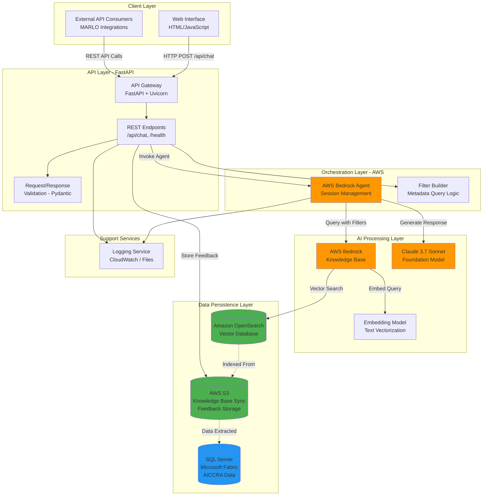
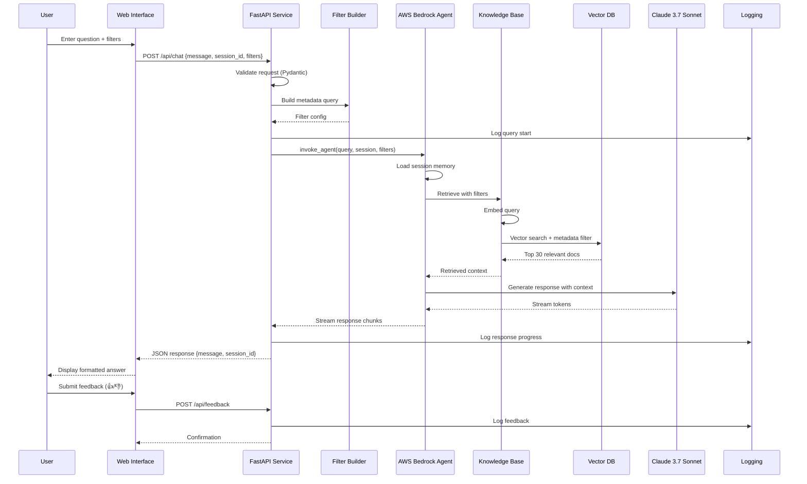

# High-Level Software Design Document
## AICCRA AI Chatbot Service

**Document Version:** 1.0  
**Service:** AICCRA AI Chatbot Service  
**Platform:** MARLO-AICCRA AI Services Module  
**Prepared For:** Executive and Technical Stakeholders  
**Date:** February 2026

---

## 1. Purpose & Scope

This document describes the high-level architecture and design of the AICCRA AI Chatbot Service, a conversational AI system that provides natural language access to AICCRA program data within the MARLO platform.

### 1.1 What This Module Does

The AICCRA AI Chatbot Service enables stakeholders to interact with AICCRA (Accelerating Impacts of CGIAR Climate Research for Africa) program data through natural language conversations. Users can query information about deliverables, innovations, contributions, performance indicators, and outcome reports without needing to navigate complex database structures or write SQL queries.

The system retrieves relevant information from a vector-indexed knowledge base, applies user-specified filters, and generates contextual responses grounded in actual program data. It maintains conversation history across sessions, allowing users to ask follow-up questions that build upon previous context.

### 1.2 Primary Use Cases

**Program Management:** Track cluster performance, monitor milestone achievement, analyze progress against targets, and identify performance gaps across indicators and reporting phases.

**Research Discovery:** Locate publications, research outputs, innovations, and technical documentation relevant to specific themes, regions, or indicators.

**Reporting & Compliance:** Extract data for donor reports, validate contribution narratives, compile evidence for specific indicators, and verify data completeness.

**Impact Assessment:** Retrieve outcome case reports, analyze real-world impact stories, and explore evidence of innovation adoption and farmer-level effects.

### 1.3 In Scope

- Natural language query processing for AICCRA program data
- Conversational AI with session-based memory
- Vector semantic search across knowledge base
- Metadata-driven filtering by phase, indicator, and section
- Citation and source linking to original documents
- REST API and web-based user interface
- User feedback collection for quality improvement
- Serverless deployment on AWS infrastructure

### 1.4 Out of Scope

- Direct database modifications or data entry
- Real-time database synchronization (data refresh is manual/scheduled)
- Authentication and user management (delegated to MARLO platform)
- Advanced analytics dashboards or visualization generation
- Multi-language translation beyond model capabilities
- Automated report generation from templates

---

## 2. System Overview

The AICCRA AI Chatbot Service is a **cloud-native microservice** deployed as a serverless REST API with an accompanying web interface. It functions as an intelligent data access layer between end users and the MARLO-AICCRA database infrastructure.

### 2.1 System Type

**Microservice Architecture:** Standalone API service with clear boundaries and responsibilities, independently deployable and scalable.

**Deployment Model:** AWS Lambda serverless functions with API Gateway integration, enabling automatic scaling and pay-per-use cost optimization.

### 2.2 Main Responsibilities

1. **Query Interpretation:** Translate natural language questions into semantic search operations
2. **Context Retrieval:** Fetch relevant documents from vector-indexed knowledge base using similarity search
3. **Response Generation:** Synthesize contextual answers from retrieved evidence using large language models
4. **Session Management:** Maintain conversation history and context across multiple user interactions
5. **Filter Application:** Apply metadata filters to narrow retrieval scope based on phase, indicator, or section
6. **Citation Management:** Provide hyperlinks and references to source documents in responses
7. **Feedback Collection:** Capture user satisfaction signals and comments for continuous improvement

### 2.3 Processing Approach

**Hybrid AI Architecture:** The system combines retrieval-augmented generation (RAG) with conversational AI agents. It does not use rule-based validation but relies on semantic search and foundation model reasoning.

**Vector Semantic Search:** User queries are embedded and matched against pre-indexed AICCRA data using vector similarity, enabling conceptual matching beyond keyword search.

**Foundation Model Reasoning:** AWS Bedrock Claude 3.7 Sonnet interprets user intent, processes retrieved context, and generates coherent responses with proper citations.

**Memory-Enabled Conversations:** Session state is maintained in AWS Bedrock Agents, allowing multi-turn conversations where follow-up questions reference previous context.

### 2.4 Data Sources

**Primary Data Source:** Microsoft SQL Server (Microsoft Fabric Lakehouse) containing AICCRA program data including deliverables, contributions, innovations, outcome reports, and performance indicators.

**Knowledge Base:** AWS Bedrock Knowledge Base with Amazon OpenSearch vector index containing pre-processed JSONL records derived from database views.

**Data Refresh:** Knowledge base is periodically synchronized with database through optional data reload operations that extract, transform, and re-upload structured data.

---

## 3. High-Level Architecture

### 3.1 Architecture Summary

The system follows a **layered microservice architecture** with clear separation between presentation, API orchestration, AI processing, and data persistence layers.

**Architectural Style:** Serverless, event-driven REST API with stateful session management delegated to managed AI services.

**Key Layers:**
1. **Presentation Layer:** HTML/JavaScript web interface and external API consumers
2. **API Gateway Layer:** FastAPI REST endpoints with request validation and error handling
3. **Orchestration Layer:** AWS Bedrock Agents coordinating retrieval and generation
4. **AI Processing Layer:** Foundation models for embedding and text generation
5. **Data Layer:** Vector database (OpenSearch) and structured database (SQL Server)
6. **Integration Layer:** AWS S3 for knowledge base synchronization and feedback storage

---

### 3.2 Core Components

#### **API Service (FastAPI Application)**
**Responsibilities:**
- Expose REST endpoints for chat interactions, health checks, and feedback submission
- Validate incoming requests using Pydantic models
- Handle CORS for web client access
- Provide OpenAPI documentation
- Manage error responses and logging

**Interaction:** Receives HTTP requests from clients, invokes Bedrock Agent runtime, streams responses back to users.

**State:** Stateless; does not maintain session data locally. Session continuity is managed by AWS Bedrock Agents.

---

#### **AWS Bedrock Agent (Conversational Orchestrator)**
**Responsibilities:**
- Maintain conversation memory across sessions
- Interpret user queries and retrieve relevant context from knowledge base
- Construct prompts with retrieved evidence
- Apply metadata filters to knowledge base queries
- Generate responses using Claude 3.7 Sonnet foundation model

**Interaction:** Invoked by API service via AWS SDK. Retrieves context from Knowledge Base, generates responses, maintains session state.

**State:** Stateful; persists conversation history per session ID and memory ID (user email).

---

#### **AWS Bedrock Knowledge Base (Vector Store Interface)**
**Responsibilities:**
- Index AICCRA JSONL records as vector embeddings
- Perform semantic similarity search against user queries
- Apply metadata filters (phase, year, indicator, table type)
- Return top-K relevant documents to agent

**Interaction:** Queried by Bedrock Agent during knowledge retrieval phase. Backed by Amazon OpenSearch vector database.

**State:** Stateful; stores vector embeddings and metadata. Refreshed periodically from S3 data uploads.

---

#### **Amazon OpenSearch (Vector Database)**
**Responsibilities:**
- Store dense vector embeddings of AICCRA data records
- Execute fast approximate nearest neighbor (ANN) searches
- Support hybrid search combining vector similarity and metadata filtering
- Scale horizontally to handle large document volumes

**Interaction:** Accessed by AWS Bedrock Knowledge Base during retrieval operations.

**State:** Stateful; persistent vector index with metadata.

---

#### **Filter Builder Utility (Metadata Query Constructor)**
**Responsibilities:**
- Translate user filter selections (phase, indicator, section) into metadata query structures
- Construct AWS Knowledge Base filter syntax
- Handle phase decomposition (year extraction, phase name parsing)
- Manage special cases for contributions requiring phase-specific filtering

**Interaction:** Invoked by API service before calling Bedrock Agent. Produces vector search configuration dictionaries.

**State:** Stateless; pure transformation logic.

---

#### **Logging Utility (Observability Layer)**
**Responsibilities:**
- Capture structured logs with timestamp, severity, and context
- Write logs to console (stdout) and rotating log files
- Provide centralized logger instance across all modules

**Interaction:** Used by all components for diagnostic and audit logging.

**State:** Stateless; writes to external storage (/tmp/logs in Lambda environment).

---

#### **Feedback Collection System**
**Responsibilities:**
- Accept user feedback (positive/negative) with optional comments
- Generate unique feedback IDs
- Store feedback records to AWS S3 with metadata
- Organize feedback by date and service for later analysis

**Interaction:** Invoked via dedicated API endpoint. Writes JSON records to S3 feedback prefix.

**State:** Stateless; feedback is persisted to S3, not held in memory.

---

#### **Web Interface (HTML/JavaScript Client)**
**Responsibilities:**
- Provide browser-based chat interface with message history
- Render filter controls for phase, indicator, and section selection
- Stream AI responses in real-time
- Allow users to submit feedback on responses
- Manage session ID generation and conversation state in browser

**Interaction:** Calls API service via HTTP POST to /api/chat endpoint. Updates UI dynamically based on streaming responses.

**State:** Stateful in browser; maintains session ID and conversation history locally.

---

### 3.3 Architecture Diagram

---

## 4. Data Flow

### 4.1 Standard Query Flow (Typical User Interaction)

1. **User Input:** User submits a natural language question via web interface or API call, optionally selecting filters (phase, indicator, section).

2. **Request Reception:** FastAPI API service receives HTTP POST request at `/api/chat` endpoint with message, session ID, memory ID (user email), and filter parameters.

3. **Request Validation:** Pydantic models validate request structure, ensuring required fields are present and constraints are met.

4. **Filter Construction:** Filter Builder utility translates user filter selections into AWS Knowledge Base metadata query syntax.

5. **Agent Invocation:** API service calls AWS Bedrock Agent Runtime with user query, session ID, memory ID, and constructed filter configuration.

6. **Session Retrieval:** Bedrock Agent retrieves conversation history for the given session ID to maintain context.

7. **Query Embedding:** User query is converted to a dense vector embedding by the Knowledge Base embedding model.

8. **Vector Search:** AWS Bedrock Knowledge Base queries Amazon OpenSearch with query embedding and metadata filters, retrieving top 30 relevant documents using hybrid search.

9. **Context Assembly:** Retrieved documents (AICCRA data records) are provided as context to Claude 3.7 Sonnet along with the user's question and system prompt.

10. **Response Generation:** Claude 3.7 Sonnet generates a contextual answer grounded in the retrieved evidence, including citations and hyperlinks.

11. **Streaming Response:** Generated response is streamed token-by-token back through Bedrock Agent to API service.

12. **Response Delivery:** API service collects streamed chunks and returns complete response to client in JSON format with session ID and applied filters.

13. **UI Update:** Web interface displays AI response with markdown formatting and hyperlinks.

14. **Logging:** All steps are logged to CloudWatch and local log files for monitoring and debugging.

---

### 4.2 Data Refresh Flow (Periodic Knowledge Base Update)

1. **Trigger:** User or scheduled process initiates data refresh by setting `insert_data=true` in API request, or by running data extraction scripts manually.

2. **Database Query:** Data extraction process queries SQL Server views to retrieve deliverables, contributions, innovations, outcome reports, and questions data.

3. **Data Transformation:** Retrieved records are transformed into JSONL format with content fields and metadata (year, phase, indicator, table type).

4. **File Segmentation:** Large JSONL files are divided into individual CSV files per record to optimize vector indexing.

5. **S3 Upload:** Processed files are uploaded to AWS S3 bucket under knowledge base data prefix.

6. **Knowledge Base Sync:** AWS Bedrock Knowledge Base detects new files in S3 and triggers re-ingestion and re-indexing.

7. **Vector Embedding:** New records are embedded and indexed in Amazon OpenSearch, replacing or augmenting existing vectors.

8. **Availability:** Updated knowledge base becomes available for subsequent queries, ensuring responses reflect latest database state.

---

### 4.3 Feedback Submission Flow

1. **User Feedback:** User clicks thumbs up/down button in web interface after receiving an AI response, optionally adding a comment.

2. **Feedback Request:** Web interface sends HTTP POST to `/api/feedback` (or dedicated endpoint) with feedback type, comment, session ID, user message, and AI response.

3. **Feedback Processing:** Feedback utility generates unique feedback ID, captures timestamp, and constructs feedback record with metadata.

4. **Local Save:** Feedback record is temporarily written as JSON file to local filesystem.

5. **S3 Upload:** JSON feedback file is uploaded to S3 under feedback prefix organized by date.

6. **Local Cleanup:** Temporary local file is deleted after successful upload.

7. **Response Confirmation:** API returns feedback ID and success confirmation to client.

8. **Analysis:** Feedback records in S3 can be later analyzed to identify quality issues and improvement opportunities.

---

### 4.4 Sequence Diagram (Standard Query)

---

## 5. Technologies Used

### Programming Languages
- **Python 3.13** — Core application language

### Web Frameworks
- **FastAPI** — REST API framework with automatic OpenAPI documentation
- **Uvicorn** — ASGI server for running FastAPI applications
- **Mangum** — AWS Lambda adapter for serverless deployment

### AI & Machine Learning
- **AWS Bedrock Agents** — Conversational AI orchestration with session memory
- **Claude 3.7 Sonnet** — Foundation model for response generation
- **AWS Bedrock Knowledge Base** — Managed RAG service with embedding and retrieval
- **Amazon Bedrock Embedding Models** — Text-to-vector transformation

### Databases & Storage
- **Microsoft SQL Server (Microsoft Fabric Lakehouse)** — Structured AICCRA program data
- **Amazon OpenSearch** — Vector database for semantic search
- **AWS S3** — Object storage for knowledge base data and feedback records

### Data Processing
- **Pandas** — Data transformation and JSONL generation
- **SQLAlchemy** — Database connectivity and query execution
- **Boto3** — AWS SDK for Python (S3, Bedrock, OpenSearch integration)

### API & Integration
- **Pydantic** — Request/response validation and data modeling
- **REST** — HTTP-based API communication style
- **CORS Middleware** — Cross-origin resource sharing for web clients
- **AWS4Auth** — AWS request signing for OpenSearch access

### Observability
- **Python logging module** — Structured logging with rotating file handlers
- **AWS CloudWatch Logs** — Centralized log aggregation in Lambda environment

### Containerization & Deployment
- **Docker** — Container packaging for Lambda deployment
- **AWS Lambda** — Serverless compute platform
- **Amazon ECR** — Container registry for Lambda images

### Frontend
- **HTML/JavaScript** — Web-based chat interface
- **Markdown** — Response formatting with hyperlinks and citations

---

## 6. Integrations & External Interfaces

### 6.1 AWS Bedrock Agents

**Direction:** Outbound  
**Purpose:** Invoke conversational AI agent for query processing and response generation  
**Authentication:** AWS IAM credentials (access key and secret key)  
**Data Format:** JSON payloads via Boto3 SDK  
**Operations:** `invoke_agent` with session state, memory ID, and streaming configuration

---

### 6.2 AWS Bedrock Knowledge Base

**Direction:** Outbound (via Bedrock Agent)  
**Purpose:** Retrieve semantically relevant documents from vector-indexed AICCRA data  
**Authentication:** Integrated within Bedrock Agent service  
**Data Format:** Vector embeddings and metadata-filtered queries  
**Operations:** Hybrid vector search with metadata filtering, top-K retrieval

---

### 6.3 Amazon OpenSearch

**Direction:** Outbound (via Knowledge Base)  
**Purpose:** Execute vector similarity searches and metadata filtering  
**Authentication:** AWS4Auth with OpenSearch domain credentials  
**Data Format:** JSON documents with vector embeddings and metadata fields  
**Operations:** Approximate nearest neighbor (ANN) search, hybrid queries

---

### 6.4 Microsoft SQL Server (Microsoft Fabric Lakehouse)

**Direction:** Outbound (data refresh only)  
**Purpose:** Extract AICCRA program data for knowledge base synchronization  
**Authentication:** OAuth2 client credentials (client ID and secret)  
**Data Format:** SQL query results transformed to JSONL  
**Operations:** Read-only queries against predefined database views (deliverables, contributions, innovations, OICRs, questions)

---

### 6.5 AWS S3

**Direction:** Bidirectional  
**Purpose:** Store knowledge base source data (JSONL files) and user feedback records  
**Authentication:** AWS IAM credentials  
**Data Format:** JSONL for knowledge base, JSON for feedback  
**Operations:**  
- **Write:** Upload JSONL files to knowledge base prefix, upload feedback JSON to feedback prefix  
- **Read:** Knowledge Base service reads JSONL files for ingestion

---

### 6.6 External API Consumers

**Direction:** Inbound  
**Purpose:** Allow external systems (MARLO dashboards, reporting tools) to integrate chatbot functionality  
**Authentication:** Delegated to API Gateway or MARLO authentication layer (not implemented in service)  
**Data Format:** JSON request/response via REST API  
**Endpoints:**  
- `POST /api/chat` — Submit query and receive AI response  
- `GET /health` — Service health check  
- `POST /api/feedback` — Submit user feedback (if implemented)

---

### 6.7 Web Interface

**Direction:** Inbound  
**Purpose:** Provide browser-based interactive chat interface for end users  
**Authentication:** None at service level (delegated to hosting environment)  
**Data Format:** JSON over HTTP  
**Operations:** HTTP POST to `/api/chat`, rendering markdown responses, managing session state in browser

---

## 7. Operational Considerations

### 7.1 Logging Approach

The service implements **structured logging** with multiple output targets:

- **Console Output (stdout):** All logs are written to stdout for CloudWatch Logs integration in Lambda environment
- **Rotating File Logs:** Local log files stored in `/tmp/logs` with 5MB rotation and 5 backup files
- **Log Levels:** DEBUG, INFO, WARNING, ERROR with severity-based filtering
- **Log Format:** Timestamp, service name, severity, file location, line number, message
- **Contextual Logging:** Session IDs, user identifiers, and operation types included in log messages

**Key Logged Events:**
- API request reception with message preview
- Filter application details
- Agent invocation timing
- Response streaming progress
- Error conditions with stack traces
- Feedback submissions with metadata

---

### 7.2 Error Handling Strategy

**Fail-fast with Graceful Degradation:**

- **Request Validation:** Reject malformed requests immediately with 400/422 HTTP status codes
- **Service Unavailability:** Return 503 errors when AWS Bedrock or OpenSearch are unreachable
- **Context Limit Errors:** Detect token overflow conditions and prompt users to simplify queries or start new sessions
- **Timeout Handling:** Return partial results or timeout messages when queries exceed threshold
- **Exception Wrapping:** All exceptions are caught, logged, and translated to user-friendly error responses

**Error Response Format:**
All errors return JSON with `error`, `details`, `status` fields for consistent client handling.

**No Automatic Retry:**
The service does not implement retry logic for failed operations. Clients must resubmit requests if needed.

---

### 7.3 Observability

**Logging:** Comprehensive logging at INFO level for all operations, DEBUG level for detailed troubleshooting.

**Metrics:** Implicit metrics via AWS Lambda CloudWatch integration (invocation count, duration, errors, throttles).

**Tracing:** Optional trace output from Bedrock Agent showing reasoning steps, knowledge base queries, and observation details.

**Health Checks:** `/health` endpoint returns service status and capability availability for monitoring systems.

**Session Tracking:** Unique session IDs enable correlation of multi-turn conversations in logs.

---

### 7.4 Scalability Assumptions

**Serverless Auto-Scaling:**
AWS Lambda automatically scales to handle concurrent requests. Each invocation is isolated and stateless at the API layer.

**Concurrency Limits:**
AWS account-level Lambda concurrency limits apply. Production deployments should configure reserved concurrency if guaranteed capacity is required.

**Vector Search Scalability:**
Amazon OpenSearch cluster size determines maximum query throughput and index size. Knowledge base should be sized appropriately for expected document volume (tens of thousands of records).

**Foundation Model Throttling:**
AWS Bedrock has per-model throughput limits. High-volume deployments may require throttle limit increases through AWS support.

**Session Memory:**
AWS Bedrock Agents maintains session state externally. No local state storage means horizontal scaling is seamless.

**Data Refresh Performance:**
Knowledge base synchronization is a long-running operation (several minutes). Concurrent data refreshes are not supported and should be scheduled during low-traffic periods.

---

### 7.5 Stateless vs Stateful Behavior

**Stateless Components:**
- FastAPI API service
- Filter Builder utility
- Logging utility
- Feedback submission logic

**Stateful Components:**
- AWS Bedrock Agent (session memory)
- AWS Bedrock Knowledge Base (vector index)
- Amazon OpenSearch (persistent vectors)
- AWS S3 (knowledge base data, feedback records)

**State Management:**
Session state is externalized to AWS Bedrock. The API service itself maintains no session data, enabling clean horizontal scaling and zero-downtime deployments.

---

### 7.6 Security Considerations

**Credential Management:**
AWS credentials, database connection strings, and API keys are stored as environment variables, loaded from `.env` file or Lambda environment configuration.

**Data Encryption:**
- **In Transit:** All AWS service communication uses TLS
- **At Rest:** S3 buckets use server-side encryption, OpenSearch indices encrypted at rest

**Input Validation:**
Pydantic models enforce input constraints (length limits, type validation) to prevent injection attacks.

**No User Authentication in Service:**
The service does not implement user authentication. It is designed to operate behind API Gateway or MARLO platform authentication layers.

**Sensitive Data:**
User email addresses (memory IDs) and query content are logged. Production deployments should ensure log access is restricted and compliant with data privacy regulations.

---

### 7.7 Performance Characteristics

**Standard Query:**
- First-turn query: 3–5 seconds (includes vector search, LLM generation, streaming)
- Follow-up query: 2–3 seconds (leverages session memory)

**Data Refresh:**
- Full knowledge base synchronization: 3–5 minutes (database extraction, file processing, S3 upload, re-indexing)

**Streaming Response:**
Tokens are pushed to client incrementally, reducing perceived latency for long responses.

**Concurrency:**
Lambda scales to hundreds of concurrent executions. Bottlenecks are typically at AWS Bedrock API throttle limits, not in service code.

---

## 8. Deployment Architecture

The service is packaged as a **Docker container** and deployed to **AWS Lambda** using the Python 3.13 runtime.

**Container Structure:**
- Base image: `public.ecr.aws/lambda/python:3.13`
- Application code: `/var/task/app/` directory
- Dependencies: Installed to `${LAMBDA_TASK_ROOT}` from `requirements.txt`
- Entry point: `main.handler` (Mangum adapter wrapping FastAPI app)

**Deployment Steps:**
1. Build Docker image with application code and dependencies
2. Push image to Amazon Elastic Container Registry (ECR)
3. Create or update Lambda function with ECR image URI
4. Configure environment variables (AWS credentials, DB connection, Knowledge Base IDs)
5. Set Lambda memory (recommended 1024MB+) and timeout (recommended 60 seconds for standard queries, 5+ minutes for data refresh)
6. Attach IAM execution role with permissions for Bedrock, S3, OpenSearch, CloudWatch Logs
7. Configure API Gateway HTTP API or Function URL for external access
8. Map custom domain (optional) and deploy to production stage

**Environment Configuration:**
All configuration is externalized via environment variables:
- AWS region and credentials
- S3 bucket name
- SQL Server connection details (server, database, OAuth credentials)
- OpenSearch host and index name
- Bedrock Knowledge Base ID, Agent ID, Agent Alias ID

---

## 9. Future Considerations

While out of scope for this design, the following capabilities may be considered for future enhancements:

**Real-Time Data Sync:** Event-driven knowledge base updates triggered by database changes rather than manual refresh.

**Advanced Analytics:** Dashboard visualizations of feedback trends, query patterns, and system performance.

**Multi-Modal Inputs:** Support for image-based queries or document uploads for context-aware processing.

**Fine-Tuned Models:** Custom foundation model fine-tuning on AICCRA domain data for improved accuracy.

**Role-Based Access Control:** User-level permissions to restrict data visibility based on organizational roles.

**Notification System:** Proactive alerts when key indicators change or performance thresholds are crossed.

**Conversational Actions:** Ability for chatbot to trigger database updates or report generation workflows.

---

## 10. Summary

The AICCRA AI Chatbot Service is a production-grade, cloud-native conversational AI microservice that democratizes access to complex program data within the MARLO-AICCRA platform. By combining AWS Bedrock's managed AI services with FastAPI's robust API framework, the system delivers fast, contextual, and accurate responses to natural language queries.

The architecture prioritizes **scalability** through serverless infrastructure, **maintainability** through clean separation of concerns, and **reliability** through comprehensive error handling and logging. The hybrid RAG approach ensures responses are grounded in actual program data while leveraging state-of-the-art foundation models for natural language understanding and generation.

This service eliminates technical barriers to data access, enabling program managers, researchers, and reporting officers to extract insights, validate contributions, and compile evidence through intuitive conversational interactions rather than manual database queries or report navigation.

---

**End of Document**
