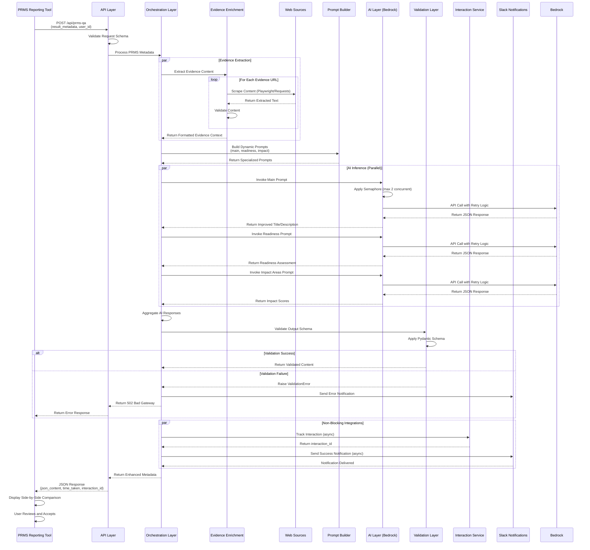

# High-Level Software Design Document
## PRMS QA Service - AI Module for Reporting Tool

**Document Version:** 1.0  
**Date:** February 27, 2026  
**Status:** Production  
**Author:** Senior Software Architect  

---

## 1. Purpose & Scope

### 1.1 Purpose

The PRMS QA Service is an AI-powered metadata enhancement module within CGIAR's Performance & Results Measurement System (PRMS). Its primary purpose is to automate the quality assurance and improvement of research result documentation by applying institutional writing standards and evidence-based enrichment through large language models.

The service addresses operational inefficiencies in CGIAR's research reporting workflow where thousands of results across multiple result types require documentation that meets strict formatting guidelines while remaining accessible to non-specialist audiences including donors, policymakers, and partner organizations. Manual quality review processes are time-intensive, inconsistent, and do not scale effectively.

The module systematically improves result titles, descriptions, short names, and impact area assessments by leveraging generative AI, domain-specific prompting strategies, and automated evidence extraction from multiple scholarly and institutional sources. This reduces manual review time from 15-30 minutes per result to under 2 minutes while ensuring consistent application of CGIAR standards across all result documentation.

### 1.2 In Scope

- Processing PRMS result metadata through REST API endpoints
- Generating improved titles, descriptions, and short names compliant with CGIAR standards
- Automated evidence extraction and enrichment from multiple sources (CGSpace, DOI articles, PDFs, web pages, SharePoint documents)
- Result type and level-specific prompt generation (Innovation Development, Knowledge Products, Capacity Development, Policy Change, Innovation Use, Other)
- Impact area assessment refinement across five CGIAR dimensions
- Output validation and schema enforcement
- Integration with external interaction tracking service for analytics
- Real-time notification delivery via Slack
- Health monitoring and comprehensive error handling

### 1.3 Out of Scope

- Direct database operations or persistence (stateless service)
- User authentication or authorization (handled by PRMS Reporting Tool)
- Result submission workflow management (frontend responsibility)
- Manual content editing or approval workflows
- Long-term storage of generated content (returned via API only)
- Multi-language support beyond English
- Training or fine-tuning of LLM models

---

## 2. System Overview

### 2.1 System Type

The PRMS QA Service is a **serverless microservice** deployed as an AWS Lambda function with API Gateway integration, providing synchronous REST API capabilities to the PRMS Reporting Tool frontend. The service operates in a stateless, event-driven architecture pattern with no persistent state management between invocations.

### 2.2 Deployment Model

- **Environment:** AWS Lambda (serverless compute)
- **Region:** US-East-1
- **Access Pattern:** Public Lambda Function URL with CORS support
- **Invocation:** Synchronous HTTP/REST (POST requests)
- **Scaling:** Automatic horizontal scaling managed by AWS Lambda
- **Runtime:** Python 3.13 with custom container image (Dockerfile-based deployment)

### 2.3 Main Responsibilities

The service orchestrates a multi-stage AI-powered enhancement pipeline:

1. **Request Processing:** Receives structured PRMS result metadata via REST API endpoint including result identification, content fields, geographic scope, impact area assessments, and supporting evidence URLs

2. **Evidence Enrichment:** Automatically extracts and processes content from multiple scholarly and institutional sources through intelligent web scraping with content validation and format detection

3. **Dynamic Prompt Construction:** Builds result type and level-specific prompts incorporating CGIAR writing standards, contextual metadata, extracted evidence, and validation rules

4. **AI Inference Orchestration:** Invokes AWS Bedrock Claude Sonnet for parallel processing of multiple inference tasks (title/description improvement, impact area refinement, readiness assessment) with rate limiting and retry logic

5. **Output Validation:** Enforces strict schema validation using Pydantic models ensuring compliance with expected output structure and data types

6. **Integration Management:** Tracks user interactions through external analytics service and delivers real-time notifications via Slack for monitoring and alerting

### 2.4 Architectural Approach

The service implements a **hybrid AI architecture** combining:

- **Generative AI Layer:** AWS Bedrock Claude Sonnet for text generation and content improvement
- **Rule-Based Validation:** Pydantic schema enforcement and structural validation
- **Retrieval-Augmented Generation (RAG):** Evidence extraction and context injection into prompts
- **Domain-Specific Prompting:** Specialized prompt templates based on result type and level classification

The system is designed for **high availability** and **fault tolerance** through:
- Stateless processing enabling horizontal scaling
- Graceful degradation with comprehensive error handling
- Retry mechanisms for transient failures
- Asynchronous notification delivery that does not block primary workflow
- Semaphore-based concurrency control for external service rate limits

---

## 3. High-Level Architecture

### 3.1 Architecture Summary

The PRMS QA Service follows a **layered microservices architecture** with clear separation of concerns across six primary layers. The system is designed as a stateless, event-driven service optimized for serverless deployment with high throughput and low latency requirements.

**Architectural Style:** Layered Architecture with Service-Oriented Components

**Key Characteristics:**
- **Stateless Operation:** No session management or persistent state between requests
- **Asynchronous Processing:** Parallel AI inference tasks with controlled concurrency
- **Declarative Validation:** Schema-driven output validation using Pydantic
- **Resilient Integration:** Fault-tolerant external service calls with timeout and retry logic
- **Observability-First:** Comprehensive structured logging throughout request lifecycle

### 3.2 Core Components

#### 3.2.1 API Layer
**Technology:** FastAPI with Mangum adapter  
**Responsibilities:**
- Expose REST endpoints for PRMS metadata processing
- Request validation and serialization using Pydantic models
- CORS configuration for cross-origin frontend access
- Health check and service information endpoints
- HTTP error handling and response formatting

**Key Characteristics:**
- Stateless request processing
- OpenAPI documentation auto-generation
- Lambda event context adaptation via Mangum

**Interacts With:** Orchestration Layer, Notification Service

**Main Components:**
- `router` - API endpoint definitions and routing logic
- `models` - Request/response Pydantic schemas
- `main` - FastAPI application initialization and middleware configuration

---

#### 3.2.2 Orchestration Layer
**Technology:** Python async/await with asyncio  
**Responsibilities:**
- Coordinate multi-stage AI enhancement pipeline
- Manage parallel LLM inference tasks with semaphore-based rate limiting
- Orchestrate evidence enrichment and prompt construction
- Aggregate results from multiple AI invocations
- Track processing time and performance metrics

**Key Characteristics:**
- Handles concurrent Bedrock API calls with controlled parallelism
- Implements exponential backoff retry logic for throttling scenarios
- Stateless coordination with no persistent workflow state

**Interacts With:** AI Layer, Data Enrichment Layer, Validation Layer, Integration Layer

**Main Components:**
- `improve_prms_result_metadata()` - Primary orchestration function
- `invoke_model_async()` - Bedrock invocation with retry logic and semaphore control

---

#### 3.2.3 AI Layer
**Technology:** AWS Bedrock (Claude Sonnet 4)  
**Responsibilities:**
- Execute generative AI inference for content improvement
- Process multiple specialized prompts in parallel (title/description, impact areas, readiness assessment)
- Generate structured JSON outputs conforming to predefined schemas

**Key Characteristics:**
- Stateless API calls via boto3 client
- Controlled concurrency with semaphore limiting (2 concurrent Bedrock calls)
- Temperature tuned for deterministic outputs (0.1)
- Maximum token configuration per inference type

**Interacts With:** Orchestration Layer, Prompt Generation Utility

**Configuration:**
- Model: `us.anthropic.claude-sonnet-4-20250514-v1:0`
- Region: `us-east-1`
- Default max_tokens: 2000 (configurable per prompt type)

---

#### 3.2.4 Data Enrichment Layer (Web Scraping)
**Technology:** Playwright, BeautifulSoup4, PyMuPDF  
**Responsibilities:**
- Intelligent URL type detection (CGSpace, DOI, SharePoint, PDF, web page)
- Multi-format content extraction (PDF, XLSX, HTML)
- Content validation and quality assessment
- Authentication and error page detection
- Reference section removal and content cleaning

**Key Characteristics:**
- Stateless scraping operations with temporary file storage
- Handles multiple source types with specialized extraction strategies
- Controlled concurrency with semaphore limiting (3 concurrent scraping tasks)
- Automatic file cleanup after processing
- Validation warnings for suspicious content

**Interacts With:** Orchestration Layer, Prompt Generation Utility

**Main Components:**
- `WebScraperService` - Core scraping engine with multi-format support
- `EvidenceEnhancer` - Integration adapter formatting evidence for LLM context

**Supported Source Types:**
- CGSpace repository handles (hdl.handle.net, cgspace.cgiar.org)
- DOI article pages (doi.org)
- SharePoint/OneDrive documents
- Direct PDF files
- Generic web pages
- Excel spreadsheets

---

#### 3.2.5 Validation Layer
**Technology:** Pydantic models  
**Responsibilities:**
- Enforce strict output schema validation for LLM responses
- Type checking and data structure validation
- JSON parsing and structural integrity verification
- Result type-specific schema application

**Key Characteristics:**
- Declarative schema definitions
- Fail-fast validation with detailed error messages
- Type-safe data structures throughout application

**Interacts With:** Orchestration Layer

**Schema Types:**
- `InnovationDevSchema` - Title, description, short name, impact areas
- `KnowledgeProductSchema` - Impact area assessments only
- `NonInnovationDevSchema` - Title, description, impact areas

---

#### 3.2.6 Integration Layer
**Responsibilities:**
- External service communication with fault tolerance
- Interaction tracking for user analytics
- Real-time notification delivery
- Timeout and error handling for external dependencies

**Key Characteristics:**
- Stateless HTTP clients
- Non-blocking operation (failures do not interrupt primary workflow)
- Configurable timeouts and retry policies

**Main Components:**

**Interaction Client:**
- Tracks user interactions with external analytics service
- Records user_id, processing time, service metadata, and context
- Timeout: 10 seconds
- Graceful failure handling (logs errors but does not block response)

**Notification Service:**
- Deliveries structured Slack messages via webhook
- Environment-aware formatting (Production vs Development indicators)
- Async delivery using aiohttp
- SSL certificate validation with certifi

---

#### 3.2.7 Supporting Utilities

**Configuration Management:**
- Environment variable loading via python-dotenv
- AWS region configuration

**Logging:**
- Structured logging with emoji-based visual indicators
- Request lifecycle tracking
- Error tracebacks for debugging

**Prompt Generation:**
- Result type and level-specific prompt templates
- Dynamic prompt construction with evidence context injection
- CGIAR writing standards and guidelines embedded in prompts
- Separate prompt builders for:
  - Main title/description improvement
  - Innovation readiness assessment
  - Innovation use-level evaluation
  - Impact area refinement

**S3 Utilities:**
- Multi-format document processing (PDF, DOCX, XLSX, PPTX, TXT)
- Excel data cleaning and structuring
- Content extraction from S3-stored documents (not actively used in current deployment)

---

## 4. Architecture Diagram

```mermaid
graph TB
    subgraph "External Systems"
        PRMS[PRMS Reporting Tool<br/>Frontend]
        Bedrock[AWS Bedrock<br/>Claude Sonnet 4]
        InteractionSvc[Interaction Service<br/>Analytics API]
        Slack[Slack Webhook]
        EvidenceSources[Evidence Sources<br/>CGSpace, DOI, Web Pages,<br/>SharePoint, PDFs]
    end

    subgraph "PRMS QA Service - AWS Lambda"
        subgraph "API Layer"
            Router[REST Endpoints<br/>FastAPI Router]
            Models[Request/Response<br/>Pydantic Models]
        end

        subgraph "Orchestration Layer"
            Orchestrator[Pipeline Orchestrator<br/>improve_prms_result_metadata]
            Invoker[AI Invoker<br/>invoke_model_async<br/>Retry + Semaphore]
        end

        subgraph "AI Layer"
            AIEngine[Generative AI<br/>Bedrock Client<br/>boto3]
        end

        subgraph "Data Enrichment Layer"
            Scraper[Web Scraper Service<br/>Multi-format Extraction]
            Enhancer[Evidence Enhancer<br/>Context Formatter]
        end

        subgraph "Validation Layer"
            SchemaValidator[Schema Validator<br/>Pydantic Models]
        end

        subgraph "Integration Layer"
            InteractionClient[Interaction Client<br/>Analytics Tracking]
            NotificationSvc[Notification Service<br/>Slack Delivery]
        end

        subgraph "Utilities"
            PromptBuilder[Prompt Builder<br/>Dynamic Templates]
            Logger[Logger<br/>Structured Logging]
            Config[Config Manager<br/>Environment Vars]
        end
    end

    PRMS -->|POST /api/prms-qa<br/>result_metadata + user_id| Router
    Router --> Models
    Models --> Orchestrator

    Orchestrator --> Enhancer
    Enhancer --> Scraper
    Scraper -->|Scrape Content| EvidenceSources
    EvidenceSources -->|Extracted Text| Scraper
    Scraper --> Enhancer
    Enhancer --> Orchestrator

    Orchestrator --> PromptBuilder
    PromptBuilder --> Orchestrator

    Orchestrator --> Invoker
    Invoker --> AIEngine
    AIEngine -->|API Call| Bedrock
    Bedrock -->|JSON Response| AIEngine
    AIEngine --> Invoker
    Invoker --> Orchestrator

    Orchestrator --> SchemaValidator
    SchemaValidator --> Orchestrator

    Orchestrator --> InteractionClient
    InteractionClient -->|Track Interaction| InteractionSvc

    Orchestrator --> NotificationSvc
    NotificationSvc -->|Send Notification| Slack

    Orchestrator --> Router
    Router -->|JSON Response<br/>Enhanced Metadata| PRMS

    Config -.->|Configuration| Orchestrator
    Config -.->|Configuration| AIEngine
    Logger -.->|Logging| Orchestrator
    Logger -.->|Logging| Scraper
    Logger -.->|Logging| Router

    style PRMS fill:#e1f5ff
    style Bedrock fill:#ff9900
    style InteractionSvc fill:#e1f5ff
    style Slack fill:#4A154B
    style EvidenceSources fill:#90EE90
    style Orchestrator fill:#FFD700
    style AIEngine fill:#ff9900
    style Scraper fill:#90EE90
    style SchemaValidator fill:#FF6B6B
```



---

## 5. Data Flow

The PRMS QA Service follows a sequential, multi-stage data processing pipeline with parallel AI inference and evidence enrichment capabilities. The following describes the complete request lifecycle from initial API invocation to final response delivery.

### 5.1 Request Initiation

**Trigger:** User clicks "AI Review" button in PRMS Reporting Tool after completing required result form fields

**Input:** HTTP POST request to `/api/prms-qa` endpoint containing:
- `result_metadata` (dict) - Complete PRMS result data including:
  - Result identification (result_id, result_type_name, result_level_name)
  - Content fields (result_name, result_description, short_title if applicable)
  - Geographic scope and partner information
  - Impact area assessments with user scores and component selections
  - Evidence URLs (list of scholarly/institutional sources)
- `user_id` (string, optional) - User identifier for interaction tracking

**Validation:** FastAPI Pydantic models enforce request structure and required fields

---

### 5.2 Evidence Enrichment Phase

**Step 1: Evidence URL Processing**
- Extract evidence URLs from `result_metadata`
- Limit processing to maximum of 5 evidence sources
- Initialize `EvidenceEnhancer` with temporary file storage directory

**Step 2: Parallel Content Extraction**
- For each evidence URL, `WebScraperService` performs intelligent URL type detection:
  - **CGSpace Handles:** Navigate to repository page, locate download link, extract PDF content via PyMuPDF
  - **DOI Articles:** Render page with Playwright, parse HTML with BeautifulSoup, extract abstract and body content
  - **SharePoint/OneDrive:** Convert URL to direct download format, retrieve document, extract text based on format (PDF/XLSX)
  - **Direct PDFs:** Download file via requests, extract text with PyMuPDF
  - **Generic Web Pages:** Render with Playwright, parse HTML, identify main content sections, remove navigation/ads
  - **Excel Spreadsheets:** Parse with pandas, clean data, structure as text chunks

**Step 3: Content Validation**
- Check minimum content length (100 characters)
- Detect authentication walls (sign-in pages, login prompts)
- Detect error pages (404, 403, 500 status indicators)
- Remove reference sections and bibliographies
- Truncate content to maximum length (40,000 characters per evidence)

**Step 4: Evidence Context Formatting**
- Structure extracted content as numbered evidence blocks
- Include title, source type, URL, and extracted text
- Generate validation warnings for suspicious content
- Aggregate successful and failed extractions into `evidence_metadata`

**Output:** Formatted evidence context string and metadata dictionary

---

### 5.3 Dynamic Prompt Construction

**Step 1: Result Type and Level Identification**
- Parse `result_type_name` (Innovation Development, Knowledge Product, Capacity Development, Policy Change, Innovation Use, Other)
- Parse `result_level_name` (Output, Outcome, Impact)

**Step 2: Main Prompt Generation**
- Call `build_main_prompt()` with result type, level, metadata, and evidence context
- Inject CGIAR-specific writing standards and guidelines based on classification
- Embed original title, description, and impact area assessments
- Include formatted evidence content from enrichment phase
- Define expected JSON output schema

**Step 3: Specialized Prompt Generation** (Conditional)
- **Innovation Readiness Assessment:** Generate readiness-level evaluation prompt for Innovation Development results
- **Innovation Use-Level Assessment:** Generate use-level evaluation prompt for Innovation Use results
- **Impact Area Refinement:** Generate impact area scoring prompt with user-provided assessments and component selections

**Output:** Multiple specialized prompts ready for parallel AI inference

---

### 5.4 AI Inference Orchestration

**Step 1: Parallel Invocation Setup**
- Create async tasks for each prompt type (main, readiness, use-level, impact areas)
- Apply semaphore control limiting to 2 concurrent Bedrock API calls
- Configure model parameters:
  - Model: Claude Sonnet 4
  - Temperature: 0.1 (deterministic outputs)
  - Max tokens: 2000 (default, varies by prompt type)
  - Top-k: 250, Top-p: 0.999

**Step 2: Inference Execution with Retry Logic**
- For each prompt, invoke `invoke_model_async()`:
  - Attempt Bedrock API call via boto3 client
  - On throttling exception (ThrottlingException, "Too many tokens"):
    - Apply exponential backoff (0.5s, 1s, 2s, 4s, 8s)
    - Retry up to 5 times
  - On success, extract text content from response
  - Log inference time and response receipt

**Step 3: Response Aggregation**
- Await all parallel inference tasks
- Collect JSON responses from each AI invocation
- Parse response text as JSON

**Output:** Multiple JSON objects containing improved content and assessments

---

### 5.5 Output Validation

**Step 1: JSON Parsing**
- Extract text content from LLM response
- Attempt JSON deserialization
- Validate JSON structure integrity

**Step 2: Schema Validation**
- Apply result type-specific Pydantic schema:
  - **Innovation Development:** Validate `new_title`, `new_description`, `short_name`, `impact_area_scores`
  - **Knowledge Product:** Validate `impact_area_scores` only
  - **Other Types:** Validate `new_title`, `new_description`, `impact_area_scores`
- Enforce type constraints and required fields
- Check impact area score format (string fields with specific values)

**Step 3: Validation Error Handling**
- On validation failure:
  - Log detailed error with traceback
  - Return HTTP 502 Bad Gateway with error classification
  - Send Slack notification indicating validation failure
  - Provide debug information for frontend handling

**Output:** Validated JSON content conforming to expected schema

---

### 5.6 Integration and Tracking

**Step 1: Interaction Tracking** (Async, Non-Blocking)
- Call external Interaction Service API
- Send payload containing:
  - `user_id` from request
  - `ai_output` (complete JSON response)
  - `service_name` ("text-mining")
  - `response_time_seconds` (processing duration)
  - `context` (result type, level, evidence metadata)
  - `platform` ("STAR")
- Timeout: 10 seconds
- On failure: Log error but continue processing

**Step 2: Slack Notification** (Async, Non-Blocking)
- Format structured Slack message with:
  - Environment indicator (Production/Development)
  - Result type and user identifier
  - Processing time
  - Success/failure status with color coding
  - Priority level
- Send via webhook URL
- On failure: Log error but continue processing

**Output:** Interaction tracking ID (if successful) and notification delivery status

---

### 5.7 Response Delivery

**Step 1: Response Construction**
- Build `PrmsResponse` Pydantic model:
  - `time_taken` (string) - Total processing time in seconds
  - `json_content` (dict) - Validated improved result metadata
  - `interaction_id` (string, optional) - Tracking identifier from analytics service
  - `evidence_metadata` (dict, optional) - Summary of evidence processing (count, successful, failed)
  - `status` ("success")

**Step 2: HTTP Response**
- Return JSON response with 200 OK status
- CORS headers applied via middleware
- Response logged for observability

**Step 3: Frontend Display**
- PRMS Reporting Tool receives enhanced metadata
- Displays improved title, description, short name side-by-side with original
- User reviews, accepts, edits, or regenerates suggestions
- Final submission to PRMS includes user-approved content

**Output:** Complete enhanced result metadata returned to frontend

---

### 5.8 Error Scenarios

**Validation Errors (400 Bad Request):**
- Missing required fields in request
- Invalid result type or level values
- Malformed input structure

**LLM Validation Errors (502 Bad Gateway):**
- AI model returns invalid JSON
- Schema validation fails on model output
- Output structure does not match expected format

**Throttling Errors (503 Service Unavailable):**
- Bedrock API rate limits exceeded after max retries
- Concurrent request limits reached

**Internal Errors (500 Internal Server Error):**
- Unhandled exceptions in processing pipeline
- Database/storage connectivity issues
- Timeout on external service calls

All errors include:
- User-friendly error message
- Technical error details
- Error type classification for frontend handling
- Debug information (traceback, context)
- Slack notification for high-priority errors

---

### 5.9 Data Flow Sequence Diagram



---

## 6. Technologies Used

### Programming Languages
- Python 3.13

### Web Frameworks
- FastAPI - Modern async web framework for REST API
- Mangum - AWS Lambda adapter for ASGI applications
- Uvicorn - ASGI server for local development

### AI and Machine Learning
- AWS Bedrock - Managed AI service for LLM inference
- Claude Sonnet 4 (Anthropic) - Large language model for text generation
- Pydantic - Data validation and schema enforcement

### Web Scraping and Content Extraction
- Playwright - Browser automation for dynamic content rendering
- BeautifulSoup4 (bs4) - HTML parsing and content extraction
- PyMuPDF (fitz) - PDF text extraction
- lxml - XML and HTML parsing library
- Requests - HTTP client for direct file downloads
- aiohttp - Asynchronous HTTP client

### Data Processing
- pandas - Tabular data processing for Excel files
- openpyxl - Excel file format support
- NumPy - Numerical computing support
- python-docx - Microsoft Word document processing
- python-pptx - Microsoft PowerPoint document processing
- PyPDF2 - PDF manipulation

### Cloud and Infrastructure
- AWS Lambda - Serverless compute platform
- AWS Bedrock - AI inference platform
- boto3 - AWS SDK for Python
- Docker - Containerization for Lambda deployment
- Public ECR (AWS Lambda Python 3.13 base image)

### Configuration and Environment
- python-dotenv - Environment variable management
- certifi - SSL certificate validation

### Logging and Observability
- Python logging - Structured logging framework

### API Communication
- REST - Synchronous request/response API pattern
- JSON - Primary data exchange format
- HTTP/HTTPS - Transport protocol

### Key Dependencies Summary
```
boto3                 # AWS SDK
fastapi               # API framework
uvicorn               # ASGI server
mangum                # Lambda adapter
pydantic              # Data validation
playwright            # Browser automation
beautifulsoup4        # HTML parsing
pymupdf               # PDF extraction
requests              # HTTP client
aiohttp               # Async HTTP client
pandas                # Data processing
openpyxl              # Excel support
python-dotenv         # Environment config
```

---

## 7. Integrations & External Interfaces

### 7.1 PRMS Reporting Tool (Frontend)

**Integration Type:** Synchronous REST API Consumer  
**Direction:** Bidirectional (Request/Response)  
**Protocol:** HTTPS  
**Data Format:** JSON  

**Interface:**
- **Endpoint:** `POST /api/prms-qa`
- **Request Payload:**
  - Content-Type: `application/json`
  - Body: `{"result_metadata": {...}, "user_id": "..."}`
- **Response Payload:**
  - Status: 200 OK (success), 400/502/503/500 (errors)
  - Body: `{"json_content": {...}, "time_taken": "...", "interaction_id": "...", "evidence_metadata": {...}, "status": "success"}`

**Authentication:** None (Lambda Function URL with CORS)

**Error Handling:**
- Frontend receives structured error responses with `error_type` classifications
- Retry logic implemented on frontend for transient failures
- User-friendly error messages displayed in UI

**Access Pattern:**
- User-initiated on-demand processing
- Single request per result submission
- No batch processing or bulk operations

---

### 7.2 AWS Bedrock (Claude Sonnet 4)

**Integration Type:** Synchronous AI Inference Service  
**Direction:** Outbound (Request/Response)  
**Protocol:** AWS API (HTTPS)  
**Data Format:** JSON  
**Authentication:** AWS IAM credentials (Lambda execution role)

**Interface:**
- **Service:** AWS Bedrock Runtime
- **Region:** us-east-1
- **Model ID:** `us.anthropic.claude-sonnet-4-20250514-v1:0`
- **API Method:** `invoke_model()`

**Request Configuration:**
- anthropic_version: "bedrock-2023-05-31"
- max_tokens: 2000 (configurable per inference type)
- temperature: 0.1
- top_k: 250
- top_p: 0.999

**Rate Limiting:**
- Semaphore control: Maximum 2 concurrent API calls
- Retry logic: Exponential backoff on throttling (up to 5 retries)
- Timeout: None (synchronous blocking until response)

**Error Scenarios:**
- ThrottlingException - Handled with exponential backoff retry
- Service errors - Logged and propagated as 500 Internal Server Error
- Validation errors - Model returns invalid JSON, propagated as 502 Bad Gateway

---

### 7.3 Interaction Service (Analytics)

**Integration Type:** Asynchronous Analytics Tracking API  
**Direction:** Outbound (Fire-and-Forget)  
**Protocol:** HTTPS REST  
**Data Format:** JSON  
**Authentication:** None (public endpoint)

**Interface:**
- **Base URL:** `https://clv3b6bv9d.execute-api.us-east-1.amazonaws.com`
- **Endpoint:** `POST /api/interactions`
- **Timeout:** 10 seconds

**Request Payload:**
```json
{
  "user_id": "...",
  "ai_output": "...",
  "service_name": "text-mining",
  "display_name": "PRMS QA Service",
  "service_description": "AI-powered metadata enhancement",
  "context": {...},
  "response_time_seconds": 1.23,
  "platform": "STAR"
}
```

**Response Payload:**
```json
{
  "interaction_id": "..."
}
```

**Error Handling:**
- Non-blocking - Failures do not interrupt primary workflow
- Timeout exception handled gracefully (logs error, continues processing)
- Network errors logged but not propagated to user

**Purpose:**
- Track user interactions for analytics and improvement
- Capture processing time, result type, and user context
- Enable feedback collection and service usage monitoring

---

### 7.4 Slack Notifications

**Integration Type:** Asynchronous Notification Webhook  
**Direction:** Outbound (Fire-and-Forget)  
**Protocol:** HTTPS  
**Data Format:** JSON (Slack Block Kit format)  
**Authentication:** Webhook URL (env variable: `SLACK_WEBHOOK_URL`)

**Interface:**
- **Method:** POST
- **Content-Type:** `application/json`
- **SSL:** Certificate validation with certifi

**Notification Types:**
1. **Success Notifications:**
   - Emoji: `:ai: :sparkles:`
   - Color: Green (#36a64f)
   - Priority: Low
   - Includes: User ID, result type, processing time

2. **Error Notifications:**
   - Emoji: `:ai: :alert:`
   - Color: Red (#ff0000)
   - Priority: High
   - Includes: Error type, user ID, validation details

**Environment Indicators:**
- Production: 🚀 Production 🚀
- Development: 🚧 Development 🚧

**Error Handling:**
- Non-blocking - Failures do not interrupt primary workflow
- Errors logged but not propagated
- SSL connection failures handled gracefully

---

### 7.5 Evidence Sources (Web Scraping Targets)

**Integration Type:** Content Extraction via Web Scraping  
**Direction:** Outbound (Read-Only)  
**Protocol:** HTTPS  
**Data Format:** HTML, PDF, XLSX  
**Authentication:** None (public resources) or session-based

**Supported Source Types:**

#### CGSpace Repository
- **URL Patterns:** `hdl.handle.net`, `cgspace.cgiar.org/handle`, `cgspace.cgiar.org/items`
- **Extraction Method:** Playwright navigation + PDF download + PyMuPDF text extraction
- **Fallback:** DOI extraction if PDF download fails → Follow DOI scraping workflow

#### DOI Articles
- **URL Pattern:** `doi.org/*`
- **Extraction Method:** Playwright dynamic rendering + BeautifulSoup HTML parsing
- **Target Content:** Abstract, article body, methodology sections
- **Challenge Handling:** Cookie consent modals, authentication walls

#### SharePoint/OneDrive
- **URL Patterns:** `sharepoint.com`, `onedrive.live.com`, `1drv.ms`, `drive.google.com`
- **Extraction Method:** URL conversion to direct download + requests download + format-specific extraction
- **Supported Formats:** PDF (PyMuPDF), XLSX (pandas)

#### Direct PDFs
- **URL Pattern:** URLs ending in `.pdf`
- **Extraction Method:** requests download + PyMuPDF text extraction
- **Validation:** Minimum content length, authentication page detection

#### Generic Web Pages
- **Extraction Method:** Playwright rendering + BeautifulSoup parsing
- **Target Elements:** `<main>`, `<article>`, content divs
- **Content Cleaning:** Remove navigation, ads, scripts, stylesheets

#### Excel Documents
- **Extraction Method:** pandas parsing + data cleaning + structured text formatting
- **Processing:** Remove empty rows/columns, deduplicate, format as key-value pairs

**Concurrency Control:**
- Semaphore: Maximum 3 concurrent scraping tasks

**Content Validation:**
- Minimum length: 100 characters
- Authentication detection: Keywords like "sign in", "log in", "access denied"
- Error detection: HTTP status codes (404, 403, 500), error page keywords

**File Management:**
- Temporary storage: `/tmp/evidence_downloads` (Lambda ephemeral storage)
- Automatic cleanup after text extraction
- Fallback to `/tmp` on read-only filesystem errors

---

### 7.6 Integration Architecture Summary

```
PRMS Reporting Tool (Frontend)
        ↓ (Synchronous REST)
    API Layer
        ↓
Orchestration Layer
    ├──→ AWS Bedrock (Synchronous AI Inference)
    │       - Retry logic with exponential backoff
    │       - Semaphore limited to 2 concurrent calls
    │
    ├──→ Evidence Sources (Synchronous Web Scraping)
    │       - Multiple source types with intelligent detection
    │       - Semaphore limited to 3 concurrent scraping tasks
    │       - Content validation and cleaning
    │
    ├──→ Interaction Service (Async Analytics, Non-Blocking)
    │       - 10-second timeout
    │       - Graceful failure handling
    │
    └──→ Slack Notifications (Async Webhooks, Non-Blocking)
            - SSL-secured delivery
            - Graceful failure handling
```

**Key Integration Principles:**
- **Critical Path:** Only AWS Bedrock and Evidence Sources block the primary response
- **Fault Tolerance:** Non-critical integrations (Analytics, Slack) fail gracefully without impacting user experience
- **Rate Limiting:** Semaphore-based concurrency control prevents overwhelming external services
- **Retry Logic:** Exponential backoff for transient failures in critical paths
- **Timeout Management:** All external calls have explicit timeouts to prevent indefinite blocking

---

## 8. Operational Considerations

### 8.1 Logging Approach

**Strategy:** Structured logging with contextual information and visual indicators

**Implementation:**
- Custom logger utility (`logger_util.py`) providing consistent logging interface
- Emoji-based visual markers for log level recognition:
  - 🔍 - Processing initiation
  - ✅ - Successful operations
  - ❌ - Errors and failures
  - ⚠️ - Warnings and validation issues
  - ⏱️ - Performance and timing information
  - 🚀 - AI inference invocations
  - 📚 - Evidence processing
  - 🔗 - External service calls

**Log Levels:**
- INFO - Normal operational events (request processing, successful operations)
- WARNING - Validation concerns, failed evidence extractions, non-critical errors
- ERROR - Critical failures, exception tracebacks, integration errors

**Logged Information:**
- Request initiation with user_id
- Evidence extraction progress and results
- AI inference timing and prompt names
- Validation successes and failures
- External service call outcomes
- Processing duration
- Error tracebacks with full context

**Log Destinations:**
- CloudWatch Logs (Lambda default)
- Local file system for development (`data/logs/`)

**Retention:** Managed by AWS Lambda CloudWatch Logs configuration

---

### 8.2 Error Handling Strategy

**Philosophy:** Fail gracefully with detailed error context while maintaining service availability

**Error Categories:**

#### 1. Validation Errors (400 Bad Request)
- **Trigger:** Invalid request structure, missing required fields
- **Handling:** FastAPI automatic validation with Pydantic models
- **Response:** Structured error with field-level details
- **User Impact:** Immediate feedback with corrective guidance

#### 2. LLM Validation Errors (502 Bad Gateway)
- **Trigger:** AI model returns invalid JSON or non-compliant schema
- **Handling:** 
  - Comprehensive schema validation with Pydantic
  - Detailed error logging with response content
  - Slack notification for high-priority monitoring
- **Response:** User-friendly message with error type classification
- **User Impact:** Retry guidance, debugging context for support teams

#### 3. Throttling Errors (503 Service Unavailable)
- **Trigger:** Bedrock API rate limits exceeded
- **Handling:**
  - Exponential backoff retry (0.5s → 8s over 5 attempts)
  - Semaphore-based concurrency limiting (2 concurrent Bedrock calls)
  - After max retries, return 503 with retry-after guidance
- **Response:** Temporary unavailability message
- **User Impact:** Automatic retry from frontend or user-initiated retry

#### 4. Evidence Extraction Errors (Non-Blocking)
- **Trigger:** Failed web scraping, authentication walls, invalid content
- **Handling:**
  - Per-evidence error isolation (continue processing remaining evidences)
  - Validation warnings logged for each failed extraction
  - Evidence metadata includes success/failure counts
  - Processing continues with available evidences
- **Response:** Successful response with evidence_metadata indicating partial failures
- **User Impact:** Degraded enrichment but functional output

#### 5. Integration Errors (Non-Blocking)
- **Trigger:** Interaction service timeout, Slack webhook failure
- **Handling:**
  - Graceful failure with error logging
  - Does not block primary response
  - Timeout enforcement (10s for interaction service)
- **Response:** Successful response without interaction_id
- **User Impact:** Analytics gap but no functional degradation

#### 6. Internal Errors (500 Internal Server Error)
- **Trigger:** Unhandled exceptions, unexpected system errors
- **Handling:**
  - Full traceback logging
  - Slack notification for critical errors
  - Generic user-facing error message
- **Response:** Internal error indication with support contact guidance
- **User Impact:** Service unavailable, escalation to support team

**Error Response Structure:**
```json
{
  "error": "User-friendly message",
  "status": "error",
  "message": "Technical error details",
  "error_type": "VALIDATION_ERROR | INVALID_AI_RESPONSE | THROTTLING_ERROR | INTERNAL_ERROR",
  "debug_info": {
    "traceback": "...",
    "context": {...}
  }
}
```

**Retry Strategies:**
- **Transient Failures:** Exponential backoff on throttling
- **Permanent Failures:** Immediate error return with user guidance
- **Partial Failures:** Continue processing with degraded functionality

---

### 8.3 Observability

**Metrics and Monitoring:**

**Available Metrics (via CloudWatch):**
- Request count and rate
- Processing duration (tracked via `time_taken` field)
- Error rate by error type
- Lambda invocation metrics (duration, memory, cold starts)
- Concurrent execution count
- Throttle events

**Tracing:**
- Request lifecycle logging from API entry to response delivery
- Stage-specific timing (evidence extraction, AI inference, validation)
- External service call tracking

**Alerting Channels:**
- Slack notifications for critical errors and validation failures
- CloudWatch Alarms (can be configured for error rate thresholds)

**Health Monitoring:**
- `/health` endpoint - Returns service status and metadata
- Health check includes timestamp and version information
- Used for availability monitoring and load balancer health checks

**Debug Capabilities:**
- Full exception tracebacks in error responses
- Debug context in 502 errors (response wrapper detection, schema validation details)
- Evidence validation warnings for content quality assessment

---

### 8.4 Scalability Assumptions

**Horizontal Scaling:**
- **Stateless Design:** No shared state between requests enables unlimited horizontal scaling
- **Lambda Auto-Scaling:** AWS Lambda automatically provisions additional execution environments based on request volume
- **No Database Dependencies:** Eliminates database connection pooling and transaction coordination as scaling bottlenecks

**Concurrency Limits:**
- **Bedrock API:** Semaphore limited to 2 concurrent calls per Lambda execution
- **Web Scraping:** Semaphore limited to 3 concurrent scraping tasks per Lambda execution
- **Lambda Concurrent Executions:** Configurable account-level limit (default 1000, can be increased via AWS support)

**Performance Characteristics:**
- **Average Processing Time:** 5-15 seconds per request (varies by evidence count and complexity)
- **Cold Start Impact:** Container-based Lambda deployment increases cold start time (~3-5 seconds) due to Playwright browser initialization
- **Memory Configuration:** Optimized for AI inference and web scraping workloads (recommended: 2048-3072 MB)

**Throughput Expectations:**
- **Target:** Support concurrent processing of multiple PRMS results during peak reporting periods
- **Bottleneck:** Bedrock API rate limits (account-level quotas)
- **Mitigation:** Exponential backoff retry logic gracefully handles temporary throttling

**Storage Considerations:**
- **Ephemeral Storage:** Lambda `/tmp` directory (512 MB - 10 GB configurable) for evidence downloads
- **Automatic Cleanup:** Downloaded files deleted after text extraction to prevent storage exhaustion
- **No Persistent Storage:** Eliminates storage scaling concerns

**Network Bandwidth:**
- **Inbound:** Small JSON payloads (<10 KB typical)
- **Outbound:** 
  - AI inference responses (1-5 KB per call)
  - Scraped content downloads (PDFs up to several MB)
  - Response payload (<50 KB typical)

**Cost Optimization:**
- **Serverless Pricing Model:** Pay-per-request with no idle cost
- **Bedrock On-Demand Pricing:** Token-based billing for AI inference
- **No Standing Infrastructure:** No EC2, RDS, or persistent database costs

---

### 8.5 Stateless vs Stateful Behavior

**Stateless Components (Majority):**
- **API Layer:** No session management or request correlation
- **Orchestration Layer:** Processes each request independently with no shared context
- **AI Layer:** Stateless API calls to Bedrock with no conversation history
- **Data Enrichment Layer:** Ephemeral evidence extraction with automatic cleanup
- **Validation Layer:** Pure function validation with no side effects

**Stateless Benefits:**
- Unlimited horizontal scaling capability
- No state synchronization overhead
- Simplified deployment and rollback procedures
- Resilient to Lambda execution environment recycling
- Eliminates concerns about state corruption or inconsistency

**External State Dependencies:**
- **Interaction Service:** Maintains persistent interaction history (external system responsibility)
- **Slack Notifications:** Delivers messages to persistent chat channels

**Request Scope:**
- Each API request is processed in complete isolation
- No cross-request data sharing or caching
- Evidence extraction performed fresh for each request (no content caching)
- AI model invocations do not retain conversation history

**Deployment Implications:**
- Zero-downtime deployments (blue/green or rolling updates)
- No warm-up period required (beyond Lambda cold starts)
- No state migration concerns during version updates
- Instant rollback capability without state corruption risk

**Trade-offs:**
- **Performance:** No caching of extracted evidence or AI responses (every request is fresh computation)
- **Cost:** Higher AI inference costs due to lack of result caching
- **Consistency:** No cross-request learning or adaptive behavior

---

## 9. Security Considerations

### 9.1 Authentication and Authorization

**API Authentication:** 
- No authentication layer at service level
- Security managed via AWS Lambda Function URL access control
- Frontend (PRMS Reporting Tool) responsible for user authentication

**AWS Service Authentication:**
- Lambda execution role with least-privilege IAM permissions
- Bedrock API access via IAM role credentials
- No hardcoded AWS credentials in code

### 9.2 Data Privacy

**Sensitive Data Handling:**
- No PII storage (stateless processing)
- User IDs logged for analytics (non-sensitive identifiers)
- Result metadata processed in-memory only
- No persistent storage of PRMS content

**External Data Transmission:**
- HTTPS for all external service communication
- SSL certificate validation for Slack webhooks
- No unencrypted data transmission

### 9.3 Input Validation

**Request Validation:**
- FastAPI Pydantic models enforce strict input schemas
- Type checking and required field validation at API boundary
- JSON structure validation prevents malformed requests

**Content Security:**
- AI output schema validation prevents injection attacks via LLM responses
- Evidence URL validation and error page detection
- Maximum content length limits prevent memory exhaustion

### 9.4 Rate Limiting

**Internal Rate Limiting:**
- Semaphore-based concurrency control for Bedrock API (2 concurrent)
- Semaphore-based concurrency control for web scraping (3 concurrent)

**External Rate Limiting:**
- AWS Lambda concurrent execution limits (account-level)
- Bedrock API throttling handled with exponential backoff

---

## 10. Future Considerations

### 10.1 Potential Enhancements

**Performance Optimization:**
- Evidence content caching to reduce redundant scraping
- Response caching for identical result metadata
- Asynchronous processing with webhook callbacks for long-running requests

**Feature Expansions:**
- Multi-language support for non-English results
- Batch processing API for multiple results
- Version history tracking for metadata improvements
- A/B testing framework for prompt optimization

**Observability Improvements:**
- Distributed tracing with AWS X-Ray
- Structured metrics dashboard
- Custom CloudWatch dashboards for service health visualization
- Automated anomaly detection for error rates

**Scalability Enhancements:**
- Redis cache layer for frequent evidence URLs
- CloudFront CDN for evidence content delivery
- Step Functions orchestration for long-running evidence extraction
- DynamoDB state management for async processing workflows

### 10.2 Known Limitations

**Evidence Extraction:**
- Authentication-protected content cannot be accessed
- Dynamic JavaScript-heavy sites may have incomplete rendering
- YouTube videos unsupported (no transcript extraction)
- Large PDFs (>50 MB) may timeout or consume excessive memory

**AI Model Constraints:**
- Occasional JSON formatting errors from LLM requiring retry
- Context length limits restrict total evidence content
- No conversational refinement (single-shot generation)

**Language Support:**
- English-only content processing and generation
- Non-English evidence may produce lower quality results

**Concurrency Limits:**
- Bedrock API account-level rate limits may impact high-load scenarios
- Lambda concurrent execution caps may require quota increases

---

## 11. Glossary

**CGIAR:** Consortium of International Agricultural Research Centers - Global research partnership addressing food security and agricultural development

**PRMS:** Performance & Results Measurement System - CGIAR's institutional reporting platform for research results

**Result Type:** Classification of research output (Innovation Development, Knowledge Product, Capacity Development, Policy Change, Innovation Use, Other)

**Result Level:** Hierarchical classification of research impact (Output, Outcome, Impact)

**Impact Areas:** Five CGIAR priority dimensions for measuring research contribution (Gender Equality/Youth/Social Inclusion, Climate Adaptation/Mitigation, Nutrition/Health/Food Security, Environmental Health/Biodiversity, Poverty Reduction/Livelihoods/Jobs)

**Evidence Enrichment:** Process of extracting content from external sources (publications, web pages, documents) to enhance AI context

**CGSpace:** CGIAR's institutional repository for research publications and documents (hdl.handle.net, cgspace.cgiar.org)

**LLM:** Large Language Model - AI model trained on text data for natural language generation and understanding

**AWS Bedrock:** Amazon Web Services managed AI service providing access to foundation models via API

**Claude Sonnet:** Anthropic's large language model optimized for reasoning and text generation

**Semaphore:** Concurrency control mechanism limiting simultaneous execution of specific operations

**Throttling:** API rate limiting mechanism temporarily restricting request volume

**Stateless Service:** Architecture pattern where each request is processed independently without persistent state

**Pydantic:** Python library for data validation using type annotations and schemas

**FastAPI:** Modern Python web framework for building REST APIs with automatic validation and documentation

**Mangum:** Adapter library enabling ASGI applications (FastAPI) to run on AWS Lambda

**Playwright:** Browser automation library for web scraping dynamic content

**Lambda Function URL:** AWS feature providing direct HTTPS endpoint for Lambda functions without API Gateway

---

## Document Revision History

| Version | Date | Author | Changes |
|---------|------|--------|---------|
| 1.0 | February 27, 2026 | Senior Software Architect | Initial high-level design document |

---

**End of Document**
