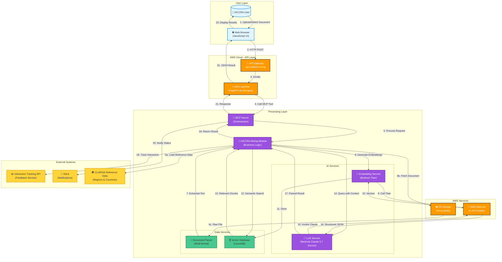
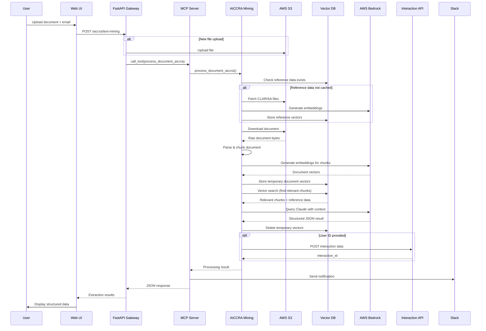

# High-Level Software Design Document
## AICCRA Text Mining Module

**Version:** 1.0  
**Date:** February 26, 2026  
**Project:** AI Services - AICCRA Text Mining  
**Organization:** CGIAR

---

## 1. Purpose & Scope

### Purpose

The AICCRA Text Mining module is an AI-powered document analysis system that extracts structured information about climate adaptation and agricultural innovation from unstructured documents. The module enables researchers and program coordinators to rapidly analyze reports, papers, and documentation to identify innovation development results with standardized metadata fields.

The system processes documents in multiple formats (PDF, Word, Excel, PowerPoint, plain text) and uses Large Language Model (LLM) capabilities combined with Retrieval-Augmented Generation (RAG) to extract specific information related to agricultural innovations, including innovation characteristics, geographical scope, readiness levels, and stakeholder information.

Users interact with the system through a web-based interface where they can upload documents or select from cloud storage, optionally customize analysis prompts, and receive structured JSON outputs that can be integrated into downstream systems for reporting and knowledge management.

The module is part of the larger MARLO platform ecosystem and specifically serves the AICCRA (Accelerating Impacts of CGIAR Climate Research for Africa) program's need to systematically track and report on innovation development outcomes.

### In Scope

- Document upload and cloud storage selection via web interface
- Multi-format document processing (PDF, DOCX, XLSX, PPTX, TXT)
- AI-driven extraction of innovation development results
- Vectorization and semantic search of document content
- Integration with CLARISA reference data for geographical validation
- Customizable analysis prompts for flexible use cases
- User interaction tracking for AI service monitoring
- Structured JSON output with predefined schema compliance
- Real-time processing with progress feedback

### Out of Scope

This document explicitly excludes:
- STAR (Strategic Transformation of Agricultural Research) text mining implementation
- PRMS (Portfolio Reporting and Management System) text mining implementation  
- Bulk upload processing capabilities
- Data warehousing or long-term storage of extracted results
- User authentication and authorization (handled by parent platform)
- Direct integration with MARLO database for result persistence
- Automated batch processing or scheduled document analysis
- Multi-language document translation capabilities

---

## 2. System Overview

The AICCRA Text Mining module is implemented as a **cloud-native microservice** deployed on AWS Lambda with a stateless REST API architecture. It operates as a serverless application that can be invoked on-demand through HTTP endpoints or embedded within other applications via iframe integration.

The system's primary responsibility is to serve as an intelligent document processor that bridges the gap between unstructured content and structured data requirements. When a user submits a document, the module orchestrates a multi-stage pipeline involving document parsing, text chunking, vector embedding generation, semantic retrieval, and LLM-based extraction.

The module employs a **hybrid AI approach** combining:
- **Retrieval-Augmented Generation (RAG)**: Document chunks are vectorized and stored temporarily in a vector database, allowing the system to retrieve only the most relevant portions for LLM processing
- **Reference Data Enrichment**: Pre-loaded geographical reference data from CLARISA (regions and countries) is embedded alongside document content to provide the LLM with standardized vocabulary for location extraction
- **Structured Prompt Engineering**: A detailed default prompt defines the exact output schema, field definitions, and validation rules that guide the LLM's extraction behavior
- **Dynamic Prompt Customization**: Users can override the default prompt to adapt the analysis for specific research questions or reporting requirements

The module is designed for **interactive, on-demand processing** rather than batch operations. Each request is independent and stateless, with temporary artifacts (vector embeddings of the uploaded document) automatically cleaned up after processing to minimize storage costs.

Key architectural characteristics:
- **Stateless Operation**: No session management; each request is fully self-contained
- **Ephemeral Vector Storage**: Temporary document embeddings are stored in LanceDB and purged after retrieval
- **Persistent Reference Cache**: CLARISA geographical data is cached in the vector database to avoid repeated initialization
- **Asynchronous Orchestration**: The Model Context Protocol (MCP) server pattern enables clean separation between API handling and processing logic
- **Progressive Enhancement**: The system gracefully handles partial extractions, validation failures, and ambiguous content

The system provides value to AICCRA stakeholders by reducing manual effort in report analysis, standardizing data extraction across diverse document sources, and enabling rapid synthesis of innovation tracking information for programmatic decision-making.

---

## 3. High-Level Architecture

### 3.1 Architecture Summary

The AICCRA Text Mining module follows a **layered microservices architecture** with event-driven characteristics. The architecture is structured into distinct layers with clear separation of concerns:

**Architectural Style**: Serverless REST API with MCP (Model Context Protocol) orchestration  
**Deployment Model**: AWS Lambda function behind API Gateway  
**Communication Pattern**: Synchronous HTTP (client-server) with internal asynchronous tool invocation  

**Major Layers**:

1. **Presentation Layer**: Web-based user interface (JavaScript SPA)
2. **API Gateway Layer**: FastAPI REST endpoints for external communication
3. **Orchestration Layer**: MCP server for processing workflow coordination
4. **AI Processing Layer**: LLM invocation and embedding generation
5. **Data Retrieval Layer**: Vector database operations and document parsing
6. **Integration Layer**: External service connectors (S3, Interaction Service, Slack)
7. **Cross-Cutting Layer**: Logging, configuration, and error handling utilities

The architecture prioritizes **modularity** and **reusability** by isolating AICCRA-specific logic from shared components. Supporting utilities for document processing, vectorization, and LLM interaction are designed to be reused across multiple text mining implementations while allowing project-specific business logic to be cleanly separated.

### 3.2 Core Components

#### **Frontend UI Component** (`interface/`)
- **Responsibilities**: 
  - Render document upload/selection interface
  - Manage user email input for tracking
  - Handle custom prompt configuration
  - Display structured extraction results with visual formatting
  - Provide download capabilities for results
- **Interactions**: Communicates exclusively with API Gateway Layer via REST HTTP
- **State**: Stateless; maintains only in-browser session state
- **Key Files**: `index.html`, `aiccra_text_mining_ui.js`

#### **API Gateway** (`app/mcp/client.py`)
- **Responsibilities**:
  - Expose REST endpoints (`/aiccra/text-mining`, `/api/auth/token`, `/list-s3-objects`)
  - Request validation and parameter extraction
  - File upload handling and S3 upload coordination
  - CORS configuration for cross-origin access
  - Response marshaling and error standardization
- **Interactions**: Receives HTTP requests from Frontend; invokes MCP Server via stdio; returns JSON responses
- **State**: Stateless
- **Note**: Deployed as AWS Lambda function via Mangum handler

#### **MCP Orchestration Server** (`app/mcp/server.py`)
- **Responsibilities**:
  - Expose processing tools via Model Context Protocol
  - Route requests to appropriate processing functions
  - Coordinate notification dispatch (Slack)
  - Centralize error handling and logging for processing pipeline
- **Interactions**: Invoked by API Gateway; calls AICCRA Mining Module; sends notifications
- **State**: Stateless; spawned per-request via stdio
- **Key Functions**: `process_document_aiccra` tool

#### **AICCRA Mining Module** (`app/llm/aiccra_mining/aiccra_mining.py`)
- **Responsibilities**:
  - Execute AICCRA-specific extraction logic
  - Initialize CLARISA reference data (regions/countries)
  - Orchestrate document processing pipeline (split → embed → retrieve → extract)
  - Apply default or custom prompt
  - Track user interactions with external service
- **Interactions**: Called by MCP Server; uses Document Parser, Vectorization Service, LLM Service, and Interaction Tracker
- **State**: Stateless; creates ephemeral vector storage per request
- **Key Function**: `process_document_aiccra(bucket_name, file_key, prompt, user_id)`

#### **Document Parser** (`app/utils/s3/s3_util.py`)
- **Responsibilities**:
  - Download documents from S3
  - Extract text from multiple formats (PDF, DOCX, XLSX, PPTX, TXT)
  - Handle Excel row-level processing as individual chunks
  - Normalize and clean extracted text
- **Interactions**: Called by Mining Module; reads from S3
- **State**: Stateless

#### **Vectorization Service** (`app/llm/vectorize.py`)
- **Responsibilities**:
  - Generate embeddings using AWS Bedrock Titan model
  - Store reference data embeddings persistently (CLARISA regions/countries)
  - Store temporary document embeddings in LanceDB
  - Perform vector similarity search to retrieve relevant chunks
  - Clean up temporary embeddings after processing
- **Interactions**: Called by Mining Module; communicates with AWS Bedrock and LanceDB
- **State**: Manages persistent LanceDB database at `/tmp/miningdb` (Lambda ephemeral storage)

#### **LLM Service** (`app/llm/mining.py`)
- **Responsibilities**:
  - Invoke AWS Bedrock Claude 3.7 Sonnet model
  - Construct prompts with context (reference data + relevant chunks + user query)
  - Parse and validate JSON responses from LLM
  - Handle text chunking with overlap strategy
- **Interactions**: Called by Mining Module; invokes AWS Bedrock
- **State**: Stateless

#### **Interaction Tracking Client** (`app/utils/interactions/interaction_client.py`)
- **Responsibilities**:
  - Record AI service usage to external feedback/tracking system
  - Capture user input, AI output, metadata, and performance metrics
  - Provide interaction IDs for downstream result linking
- **Interactions**: Called by Mining Module; POSTs to external API
- **State**: Stateless

#### **Notification Service** (`app/utils/notification/notification_service.py`)
- **Responsibilities**:
  - Send processing status notifications to Slack
  - Format messages with metadata (file, bucket, timing, environment)
- **Interactions**: Called by MCP Server; POSTs to Slack webhook
- **State**: Stateless

#### **Cross-Cutting Utilities**
- **Logger** (`app/utils/logger/logger_util.py`): Centralized logging with file rotation
- **Configuration Manager** (`app/utils/config/config_util.py`): Environment variable loading and AWS credential management
- **Prompt Repository** (`app/utils/prompt/prompt_aiccra.py`): Default AICCRA extraction prompt template

---

## 4. Architecture Diagram (Mermaid)



---

## 5. Data Flow

The AICCRA text mining process follows a sequential pipeline with conditional branching for optimization:

### **Step 1: Request Initiation**
The process begins when a user submits a document through the web interface. The user provides:
- **Document source**: Either an uploaded file or an S3 key to an existing document
- **User email**: For interaction tracking and accountability
- **Optional custom prompt**: If provided, overrides the default AICCRA extraction template

The frontend validates inputs and sends an HTTP POST request to `/aiccra/text-mining` with form data containing the document, bucket name, user ID, and optional custom prompt.

### **Step 2: API Request Handling**
The API Gateway (FastAPI) receives the request and performs:
- Parameter validation and extraction
- File upload to S3 (if a new file was provided)
- MCP tool invocation preparation by constructing arguments dictionary

The API layer delegates processing to the MCP server by invoking the `process_document_aiccra` tool via stdio communication.

### **Step 3: Reference Data Initialization**
Before processing the document, the system checks if CLARISA reference data (regions and countries) exists in the vector database:
- **Cache Hit**: If reference embeddings already exist, skip initialization
- **Cache Miss**: Download CLARISA Excel files from S3, extract row-level data, generate embeddings for each region/country record, store persistently in LanceDB reference table

This reference data provides the LLM with standardized geographical entity names for validation and mapping.

### **Step 4: Document Retrieval and Parsing**
The document is fetched from S3 and processed based on file type:
- **PDF**: Text extraction via PyPDF2
- **Word (DOCX)**: Paragraph extraction via python-docx
- **Excel (XLSX)**: Row-level processing where each row becomes an independent chunk
- **PowerPoint (PPTX)**: Slide text extraction via python-pptx
- **Plain Text**: Direct UTF-8 decoding

Excel files receive special treatment: each row is converted to a structured text format ("Column: Value, ...") to preserve tabular semantics.

### **Step 5: Text Chunking**
For non-Excel documents, the extracted text is split into overlapping chunks using a recursive character text splitter:
- **Chunk Size**: 8000 characters
- **Chunk Overlap**: 1500 characters

This overlap ensures context preservation across chunk boundaries. Excel files skip this step as rows are already pre-chunked.

### **Step 6: Embedding Generation**
Each text chunk is converted to a 1024-dimensional vector embedding using **AWS Bedrock Titan Embed Text v2**. These embeddings capture semantic meaning and enable similarity-based retrieval.

### **Step 7: Temporary Vector Storage**
Document embeddings are stored in a temporary LanceDB table with metadata:
- Text content
- Vector embedding
- Document name (filename + timestamp)
- Reference flag (false for temporary documents)

This creates an ephemeral vector index specific to the current processing request.

### **Step 8: AI Inference - Context Retrieval**
A vector similarity search is performed using the prompt (or default AICCRA prompt) as the query:
1. Generate embedding for the prompt text
2. Search the temporary document table for semantically similar chunks
3. Retrieve all reference data (CLARISA regions and countries)
4. Combine reference data + retrieved document chunks into a unified context string

The system retrieves the most relevant document sections based on the extraction goal, reducing noise and improving LLM accuracy.

### **Step 9: AI Inference - LLM Processing**
The LLM service constructs a comprehensive prompt containing:
- All reference data (geographical entities)
- Retrieved relevant document chunks
- The extraction instruction (default or custom prompt)

This prompt is sent to **AWS Bedrock Claude 3.7 Sonnet** with parameters:
- Temperature: 0.1 (low for deterministic extraction)
- Max tokens: 5000
- Model: `us.anthropic.claude-3-7-sonnet-20250219-v1:0`

The LLM analyzes the content and generates a JSON response conforming to the prompt schema.

### **Step 10: Response Validation**
The system attempts to parse the LLM output as valid JSON:
- **Valid JSON**: Parsed and structured result is retained
- **Invalid JSON**: Raw text response is wrapped in `{"text": "..."}` structure for graceful degradation

### **Step 11: Cleanup**
Temporary document embeddings are deleted from the vector database using the document name filter. Reference data embeddings remain cached for future requests.

### **Step 12: Interaction Tracking**
If a user ID was provided, the system records the interaction with the external Interaction Tracking API:
- User identifier
- Original document reference
- AI output (full JSON)
- Processing metadata (chunks processed, model used, timing)
- Response time

The tracking service returns an `interaction_id` for linking results to feedback.

### **Step 13: Notification**
A Slack notification is sent to the configured webhook containing:
- Document name and bucket
- Processing time
- Success/failure status
- Environment indicator (production vs. development)

### **Step 14: Response Return**
The API returns a JSON response to the frontend containing:
- `content`: Raw LLM response text
- `time_taken`: Processing duration in seconds
- `json_content`: Parsed structured extraction result
- `interaction_id`: (if tracking was enabled)

### **Step 15: Result Display**
The frontend renders the extraction results:
- Success message with timing
- Expandable raw JSON view
- Structured field display with formatting (keywords as tags, tables for actors/organizations)
- Support for free-form responses when custom prompts produce non-standard output

### **Optional: Sequence Diagram**



---

## 6. Technologies Used

### **Programming Languages**
- **Python 3.13**: Core backend implementation
- **JavaScript (ES6+)**: Frontend user interface

### **Web Frameworks**
- **FastAPI**: REST API framework with automatic OpenAPI documentation
- **Mangum**: ASGI adapter for deploying FastAPI on AWS Lambda

### **AI & Machine Learning**
- **AWS Bedrock**: Managed LLM service
  - Claude 3.7 Sonnet: Text extraction and analysis
  - Titan Embed Text v2: Semantic embedding generation
- **LangChain Text Splitters**: Document chunking with configurable overlap

### **Data Storage**
- **LanceDB**: Columnar vector database for embeddings (embedded, no separate server)
- **AWS S3**: Object storage for documents and reference data

### **Document Processing**
- **PyPDF2**: PDF text extraction
- **python-docx**: Microsoft Word document parsing
- **python-pptx**: PowerPoint presentation text extraction
- **pandas & openpyxl**: Excel spreadsheet processing

### **Infrastructure & Deployment**
- **AWS Lambda**: Serverless compute for API hosting
- **Docker**: Containerization for consistent deployment
- **Amazon ECR**: Container registry for Lambda images

### **Communication Protocols**
- **REST/HTTP**: Synchronous client-server communication
- **MCP (Model Context Protocol)**: Tool invocation protocol for AI service orchestration
- **stdio**: Inter-process communication between API and MCP server

### **Libraries & Utilities**
- **boto3**: AWS SDK for Python (S3, Bedrock integration)
- **pydantic**: Data validation and schema enforcement
- **aiohttp**: Asynchronous HTTP client for external API calls
- **requests**: HTTP client for synchronous integrations
- **python-dotenv**: Environment configuration management

### **Observability**
- **logging (Python standard library)**: Structured logging with file rotation
- **Slack Webhooks**: Real-time notification delivery

---

## 7. Integrations & External Interfaces

### **AWS S3 Storage**
- **Purpose**: Document repository and reference data storage
- **Direction**: Bidirectional (read documents, write uploaded files)
- **Authentication**: AWS IAM credentials (access key/secret key) from environment configuration
- **Data Format**: Binary files (PDF, DOCX, XLSX, etc.) and Excel files for reference data
- **Key Operations**:
  - `GetObject`: Download documents and CLARISA reference files
  - `PutObject`: Upload user-submitted files
  - `ListObjectsV2`: Browse available documents in cloud storage

### **AWS Bedrock (LLM Platform)**
- **Purpose**: AI model invocation for embeddings and text extraction
- **Direction**: Write (requests) and Read (responses)
- **Authentication**: AWS IAM credentials with Bedrock access permissions
- **Data Format**: JSON payloads with model-specific parameters
- **Models Used**:
  - **Claude 3.7 Sonnet** (`us.anthropic.claude-3-7-sonnet-20250219-v1:0`): Text analysis and structured extraction
  - **Titan Embed Text v2** (`amazon.titan-embed-text-v2:0`): Vector embedding generation
- **Key Operations**:
  - `invoke_model`: Synchronous model inference

### **Interaction Tracking Service**
- **Purpose**: Record AI service usage for feedback, auditing, and quality monitoring
- **Direction**: Write-only (POST interactions)
- **Endpoint**: `https://i8s5i8c21i.execute-api.us-east-1.amazonaws.com/api/interactions`
- **Authentication**: None (internal service assumed to be protected by network security)
- **Data Format**: JSON
- **Payload Fields**:
  - `user_id`: User email or identifier
  - `user_input`: Original request description
  - `ai_output`: Complete extraction result JSON
  - `service_name`: "text-mining"
  - `display_name`: "AICCRA Text Mining Service"
  - `service_description`: Service capability description
  - `context`: Metadata (bucket, file, model, timing)
  - `response_time_seconds`: Processing duration
  - `platform`: "AICCRA"
- **Response**: `{ "interaction_id": "uuid" }`

### **Slack Notifications**
- **Purpose**: Real-time alerts for processing status and operational monitoring
- **Direction**: Write-only (POST messages)
- **Authentication**: Webhook URL (secret stored in environment variable `SLACK_WEBHOOK_URL`)
- **Data Format**: JSON with Slack Block Kit formatting
- **Message Types**:
  - **Success Notifications**: Green color, document name, processing time
  - **Error Notifications**: Red color, error message, priority flag
- **Environment Tagging**: Messages indicate production vs. development environment

### **CLARISA Reference Data**
- **Purpose**: Standardized geographical entity vocabulary (UN regions, ISO countries)
- **Source**: Excel files stored in S3 (`clarisa_regions.xlsx`, `clarisa_countries.xlsx`)
- **Access Pattern**: Read-once at initialization, cached in vector database
- **Data Format**: Excel spreadsheets with structured columns
- **Usage**: Provides LLM with validated location names and codes for geoscope mapping

### **Frontend Integration (Embedding)**
- **Purpose**: User interface can be embedded in parent applications like MARLO
- **Integration Method**: Iframe or direct URL access with query parameters
- **Query Parameters**:
  - `user_email`: Pre-populate user identifier
  - `user`: Display name for welcome banner
- **Cross-Origin**: CORS enabled for all origins (`allow_origins=["*"]`)

---

## 8. Operational Considerations

### **Logging Strategy**
The system implements **structured logging** with severity levels (DEBUG, INFO, WARNING, ERROR) using Python's standard logging library. All processing stages emit descriptive log messages with emoji prefixes for visual parsing (e.g., ✅ for success, ❌ for errors, 🔍 for search operations).

Logs are written to:
- **Standard output** (captured by Lambda CloudWatch Logs)
- **Rotating log files** at `/tmp/logs/app.log` (5MB max per file, 5 backup files)

Log events include:
- Request initiation with parameters
- Document processing milestones (download, parsing, chunking)
- Embedding generation progress
- LLM invocation timing
- Result validation outcomes
- External API interaction success/failure

This approach provides comprehensive observability for debugging, performance analysis, and audit trails.

### **Error Handling Strategy**
The module employs a **fail-fast with graceful degradation** approach:

**Validation Errors**: Input validation failures (missing file, invalid email) return HTTP 400 responses immediately without processing.

**Processing Errors**: Exceptions during document processing are caught at the MCP server layer, logged with full stack traces, and returned as structured error responses:
```json
{
  "status": "error",
  "key": "document-name.pdf",
  "error": "Error message description"
}
```

**LLM Output Validation**: If the LLM returns invalid JSON, the system wraps the raw text response in a fallback structure rather than failing completely. This allows users to review the output even when schema compliance fails.

**External Service Failures**: Non-critical integrations (Interaction Tracking, Slack notifications) are wrapped in try-catch blocks with warnings logged. Processing continues even if these services fail, ensuring core functionality remains available.

**Retry Logic**: Not implemented for LLM calls due to cost considerations. Single-attempt invocation with user-initiated retry on failure.

### **Observability**
Beyond logging, the system provides observability through:
- **Slack Notifications**: Real-time visibility into processing success/failure rates and performance
- **Interaction Tracking**: Centralized repository of all AI invocations with full input/output context for quality analysis
- **Response Time Metrics**: Every successful response includes `time_taken` field for frontend display and user awareness
- **CloudWatch Integration** (implicit): As a Lambda function, all stdout/stderr automatically flows to CloudWatch Logs with request IDs

No explicit distributed tracing (e.g., X-Ray) is currently implemented.

### **Scalability Assumptions**
The architecture is designed for **moderate, human-driven usage** patterns typical of research and program management workflows:

**Concurrency**: AWS Lambda automatically scales to handle concurrent requests up to account limits (default 1000 concurrent executions). Each request is independent and does not share state.

**Document Size Limits**: The system can handle documents up to **6MB** (Lambda payload limit). Larger documents require pre-upload to S3 and passing the key.

**Processing Time**: Most documents process in **30-90 seconds** depending on size. Lambda timeout is configured to accommodate typical use cases (likely 5-10 minutes max).

**Vector Database**: LanceDB operates on Lambda's ephemeral storage (`/tmp`, 10GB limit). The temporary document embeddings for a single request consume minimal space (typically <10MB for embeddings + source text). Reference data is shared across invocations within the same Lambda container lifecycle.

**Cost Optimization**: The temporary embedding cleanup after each request prevents unbounded storage growth. Reference data (CLARISA) is cached persistently across warm Lambda invocations to avoid repeated initialization.

**Bottlenecks**: The primary performance constraint is LLM inference latency (Bedrock API call), not compute or storage. Parallel processing of multiple documents is not implemented; each API request processes one document sequentially.

### **Stateless vs. Stateful Behavior**
The system is **fundamentally stateless** at the request level:
- No session management or user authentication state
- Each API call is independent with no dependency on prior requests
- No persistent user-specific data storage

**Ephemeral state** exists only during request processing:
- Temporary vector embeddings in LanceDB (deleted after retrieval)
- In-memory document chunks and embeddings (garbage collected after response)

**Cached reference data** provides limited statefulness:
- CLARISA geographical data persists in LanceDB across requests within the same Lambda container lifecycle
- This cache is **opportunistic**: if the Lambda container is recycled, the next request re-initializes reference data
- Cache verification occurs on every request to handle cold starts

This stateless design enables horizontal scalability, simplifies deployment, and eliminates concerns about session consistency or distributed state management.

---

## End of Document

**Document Control**  
- **Prepared by**: AI Services Architecture Team  
- **Reviewed by**: AICCRA Technical Lead  
- **Approved for**: Executive and Engineering Stakeholders  
- **Distribution**: CGIAR AICCRA Program, MARLO Integration Team, AI Services Operations

**Revision History**  
| Version | Date | Author | Changes |
|---------|------|--------|---------|
| 1.0 | Feb 26, 2026 | Architecture Team | Initial high-level design document |

---

**Contact Information**  
For technical inquiries regarding this document or the AICCRA Text Mining module, please contact the AI Services team through the appropriate CGIAR communication channels.
