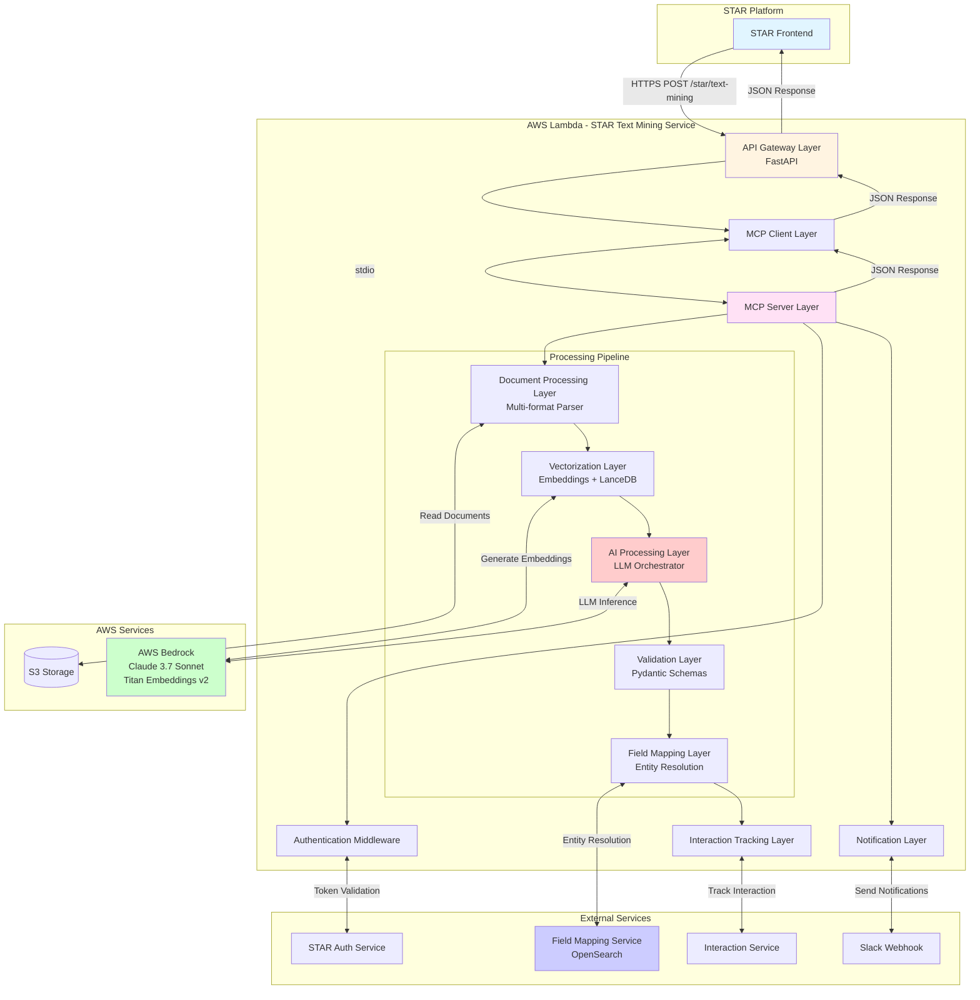
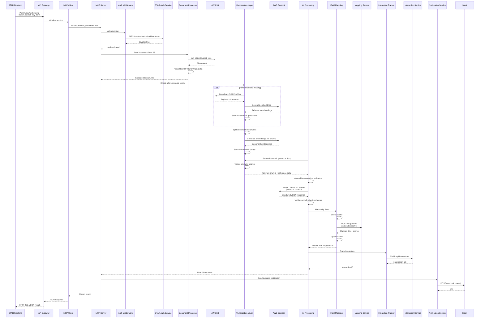

# STAR Text Mining Service
## High-Level Software Design Document

**Version:** 1.0  
**Date:** February 26, 2026  
**Module:** STAR Text Mining  
**Prepared For:** STAR AI Services Documentation

---

## 1. Purpose & Scope

### 1.1 Purpose

The STAR Text Mining Service is an AI-powered document analysis microservice designed to extract structured information from unstructured documents for the CGIAR STAR (Strategic Technical Advisory Resources) platform. The service automates the extraction of capacity development, policy change, and innovation development data from various document formats, transforming free-form text into structured, validated data ready for integration into STAR's knowledge management system.

### 1.2 What This Module Does

This service accepts documents in multiple formats (PDF, Word, Excel, PowerPoint, plain text), analyzes their content using advanced AI models, and extracts specific types of results based on predefined indicators. The extracted information includes metadata about training programs, participant demographics, geographical scope, institutional partnerships, and policy interventions. All extracted data undergoes validation and entity resolution to ensure consistency with CGIAR's reference data systems.

### 1.3 In Scope

- **STAR Text Mining Module Only:** This document covers exclusively the STAR text mining workflow, including document processing, AI-based extraction, validation, and field mapping
- **Core Processing Pipeline:** Document ingestion, parsing, vectorization, AI inference, validation, and entity resolution
- **Authentication & Authorization:** Integration with STAR's authentication service for request validation
- **External Integrations:** S3 storage, AWS Bedrock AI services, field mapping service, and interaction tracking
- **Operational Concerns:** Logging, error handling, and Slack notifications specific to STAR mining

### 1.4 Out of Scope

This documentation explicitly excludes:
- AICCRA text mining implementation
- PRMS (Policy Research and Management Systems) text mining implementation
- Bulk upload processing logic
- User interface components (provided directly by STAR)
- Infrastructure provisioning and deployment configurations
- Detailed prompt engineering strategies
- Internal algorithm implementations

### 1.5 Primary Use Case

The primary use case is an authenticated STAR user uploading a document (or referencing an existing S3 document) through the STAR platform. The service analyzes the document to identify and extract information related to capacity development activities, policy changes, or innovation development initiatives. The extracted data is returned in structured JSON format, enriched with entity identifiers from CGIAR's reference systems, and tracked for user feedback collection.

---

## 2. System Overview

### 2.1 System Classification

The STAR Text Mining Service is a **serverless microservice** deployed on AWS Lambda, exposed through AWS Lambda Function URLs. It operates as an on-demand document processing service that responds to synchronous HTTP requests from the STAR platform.

### 2.2 Architectural Approach

The service employs a **hybrid AI architecture** combining:
- **Large Language Model (LLM) Inference:** AWS Bedrock Claude 3.7 Sonnet for intelligent content extraction
- **Retrieval-Augmented Generation (RAG):** Vector similarity search using LanceDB to provide relevant context to the LLM
- **Rule-Based Validation:** Pydantic schemas for data structure validation and type checking
- **Entity Resolution:** External mapping service integration for reconciling extracted names with canonical identifiers

### 2.3 Main Responsibilities

1. **Document Ingestion:** Accept documents via direct upload or S3 reference
2. **Authentication:** Validate requests against STAR's authorization service
3. **Multi-Format Parsing:** Extract text from PDF, Word, Excel, PowerPoint, and text files
4. **Intelligent Chunking:** Divide documents into semantically meaningful segments
5. **Vectorization:** Generate embeddings for semantic similarity search
6. **Context Assembly:** Combine reference data with relevant document chunks
7. **AI Extraction:** Use LLM to extract structured information based on indicator-specific prompts
8. **Validation:** Ensure extracted data conforms to expected schemas
9. **Field Mapping:** Resolve entity names to canonical identifiers via external service
10. **Interaction Tracking:** Record user interactions for feedback and improvement
11. **Notification:** Send processing status updates via Slack

### 2.4 State Management

The service is **primarily stateless** with the following considerations:
- **Ephemeral State:** Vector embeddings are stored temporarily in `/tmp` during request processing (Lambda function lifetime)
- **Persistent Reference Data:** CLARISA region and country reference data persists in LanceDB
- **No Session Management:** Each request is independent and self-contained
- **Caching:** Field mapping results are cached during a single request processing cycle to optimize repeated lookups

---

## 3. High-Level Architecture

### 3.1 Architecture Summary

The STAR Text Mining Service implements a **layered microservice architecture** with the following characteristics:

**Architectural Style:** Serverless microservice with synchronous request-response pattern  
**Communication Protocol:** REST API (FastAPI) over HTTPS  
**Orchestration:** Model Context Protocol (MCP) for tool-based AI workflow coordination  
**Data Flow:** Pipeline-based sequential processing with validation gates  

### 3.2 Core Components

#### 3.2.1 API Gateway Layer
**Location:** `app/mcp/client.py`  
**Responsibilities:**
- Expose REST endpoint `/star/text-mining` for document processing requests
- Handle multipart file uploads and form data
- Manage CORS and request routing
- Serve API documentation via OpenAPI/Swagger

**Interactions:** Receives requests from STAR frontend, delegates to MCP Client  
**State:** Stateless  

#### 3.2.2 MCP Client Layer
**Location:** `app/mcp/client.py` (MCP protocol integration)  
**Responsibilities:**
- Establish stdio-based communication with MCP Server
- Marshal request parameters for MCP tool invocation
- Handle session lifecycle and message passing

**Interactions:** Communicates with MCP Server via stdio, receives responses  
**State:** Stateless (session per request)  

#### 3.2.3 MCP Server Layer
**Location:** `app/mcp/server.py`  
**Responsibilities:**
- Expose `process_document` tool for STAR mining
- Orchestrate authentication, processing, and notification workflows
- Handle errors and coordinate with notification service

**Interactions:** Invokes Authentication Middleware, Core Processing Layer, Notification Service  
**State:** Stateless  

#### 3.2.4 Authentication Middleware
**Location:** `app/middleware/star_auth_middleware.py`  
**Responsibilities:**
- Extract authentication tokens from requests
- Validate tokens against STAR's authorization service
- Return authentication status (boolean)

**Interactions:** Makes HTTPS requests to STAR authentication endpoint  
**State:** Stateless  

#### 3.2.5 Document Processing Layer
**Location:** `app/utils/s3/s3_util.py`  
**Responsibilities:**
- Download documents from S3
- Parse multiple file formats (PDF, DOCX, XLSX, PPTX, TXT)
- Handle Excel files as structured row-based data
- Clean and normalize extracted text

**Interactions:** Reads from AWS S3  
**State:** Stateless  

#### 3.2.6 Vectorization Layer
**Location:** `app/llm/vectorize.py`  
**Responsibilities:**
- Generate embeddings via AWS Bedrock Titan Embeddings v2
- Manage LanceDB database for vector storage
- Store reference data embeddings (persistent)
- Store temporary document embeddings (ephemeral)
- Execute semantic similarity searches

**Interactions:** Invokes AWS Bedrock, manages LanceDB in /tmp  
**State:** Stateful (reference data), ephemeral (document embeddings)  

#### 3.2.7 Core AI Processing Layer
**Location:** `app/llm/mining.py`  
**Responsibilities:**
- Initialize reference data (CLARISA regions/countries)
- Split documents into chunks using LangChain text splitters
- Assemble context from reference data and relevant document chunks
- Invoke AWS Bedrock Claude 3.7 Sonnet with structured prompts
- Parse LLM responses into JSON
- Coordinate field mapping for entity resolution
- Track interactions with feedback service

**Interactions:** Invokes Document Processing, Vectorization, LLM, Field Mapping, Interaction Tracking  
**State:** Stateless  

#### 3.2.8 Field Mapping Layer
**Location:** `app/llm/map_fields.py`  
**Responsibilities:**
- Extract entity names (staff, institutions) from LLM output
- Call external mapping service (OpenSearch-based) for entity resolution
- Cache mapping results to reduce duplicate API calls
- Apply mapped identifiers and similarity scores to results
- Handle retries with exponential backoff

**Interactions:** Makes HTTPS requests to Field Mapping Service  
**State:** Request-scoped cache  

#### 3.2.9 Validation Layer
**Location:** `app/schemas/mining_schemas.py`  
**Responsibilities:**
- Define Pydantic models for all result types
- Validate indicator-specific fields (Capacity Development, Policy Change, Innovation Development)
- Enforce data types, constraints, and business rules
- Normalize data (e.g., lowercase keywords, default values)

**Interactions:** Invoked by AI Processing Layer  
**State:** Stateless  

#### 3.2.10 Interaction Tracking Layer
**Location:** `app/utils/interactions/interaction_client.py`  
**Responsibilities:**
- Record user interactions with AI service
- Capture input context, AI outputs, and metadata
- Track response times and processing steps
- Support feedback collection workflows

**Interactions:** Makes HTTPS requests to Interaction Service  
**State:** Stateless  

#### 3.2.11 Notification Layer
**Location:** `app/utils/notification/notification_service.py`  
**Responsibilities:**
- Send processing status notifications to Slack
- Format messages with environment tags (production/development)
- Include success/failure indicators and processing times

**Interactions:** Makes HTTPS requests to Slack Webhook  
**State:** Stateless  

---

### 3.3 Architecture Diagram



---

## 4. Data Flow

### 4.1 Sequential Processing Flow

The STAR Text Mining Service processes documents through a multi-stage pipeline:

#### **Stage 1: Request Initiation**
1. User initiates document processing via STAR frontend
2. Request includes authentication token, S3 bucket/key or uploaded file, environment URL, and optional user ID
3. FastAPI endpoint `/star/text-mining` receives the HTTP POST request

#### **Stage 2: Document Upload (If Applicable)**
4. If a new file is uploaded, the service stores it in S3 under the STAR bucket prefix
5. S3 key is generated based on filename and environment

#### **Stage 3: MCP Orchestration Handoff**
6. MCP Client establishes stdio session with MCP Server
7. Request parameters marshaled and `process_document` tool invoked
8. MCP Server initializes processing workflow

#### **Stage 4: Authentication**
9. Authentication middleware extracts token and environment URL
10. Token validation request sent to STAR authorization service via HTTPS
11. Authorization service returns validation status
12. If authentication fails, processing halts with error notification

#### **Stage 5: Reference Data Initialization**
13. System checks if CLARISA reference data exists in LanceDB
14. If missing, downloads reference files (regions and countries) from S3
15. Generates embeddings for reference data using AWS Bedrock Titan Embeddings v2
16. Stores reference embeddings in persistent LanceDB table

#### **Stage 6: Document Reading & Parsing**
17. Document downloaded from S3 using boto3
18. File type detected by extension
19. Appropriate parser invoked:
    - **PDF:** PyPDF2 extracts text from all pages
    - **DOCX:** python-docx extracts paragraph text
    - **XLSX:** pandas processes rows as structured chunks
    - **PPTX:** python-pptx extracts text from slides
    - **TXT:** Direct UTF-8 decoding

#### **Stage 7: Text Chunking**
20. For non-Excel documents: LangChain RecursiveCharacterTextSplitter divides text into 8000-character chunks with 1500-character overlap
21. For Excel documents: Each row becomes an individual chunk
22. Chunks are prepared for embedding generation

#### **Stage 8: Embedding Generation**
23. Each chunk sent to AWS Bedrock Titan Embeddings v2
24. Vector embeddings (numerical representations) generated for semantic search
25. Embeddings stored in temporary LanceDB table with document identifier

#### **Stage 9: Context Assembly via Vector Search**
26. User prompt embedded using Titan model
27. LanceDB performs semantic similarity search against document embeddings
28. Top relevant chunks retrieved based on vector distance
29. All reference data (regions/countries) retrieved
30. Context assembled: reference data + relevant document chunks

#### **Stage 10: AI Inference**
31. Structured prompt built with:
    - Indicator-specific instructions (Capacity Development, Policy Change, Innovation Development)
    - Assembled context (reference + document chunks)
    - Output format requirements (JSON schema)
32. Prompt sent to AWS Bedrock Claude 3.7 Sonnet
33. LLM analyzes content and generates structured JSON response
34. Response parsing validates JSON format

#### **Stage 11: Validation**
35. JSON response parsed into Python dictionaries
36. Each result validated against appropriate Pydantic schema:
    - CapacityDevelopmentResult
    - PolicyChangeResult
    - InnovationDevelopmentResult
37. Data types, constraints, and business rules enforced
38. Invalid results filtered or corrected

#### **Stage 12: Field Mapping (Entity Resolution)**
39. Entity names extracted (contact persons, supervisors, institutions)
40. Mapping cache checked for previously resolved entities
41. Unmapped entities batched and sent to Field Mapping Service
42. OpenSearch-based fuzzy matching performed
43. Canonical identifiers and similarity scores returned
44. Results cached for subsequent use in same request
45. Mapped identifiers applied to JSON output

#### **Stage 13: Interaction Tracking**
46. If user ID provided, interaction recorded with:
    - User input context (document path, prompt snippet)
    - Complete AI output
    - Processing metadata (chunks, model, steps)
    - Response time
47. Interaction service returns interaction ID
48. Interaction ID included in response for feedback linking

#### **Stage 14: Response Return**
49. Final JSON result assembled with:
    - Extracted and validated results
    - Mapped entity identifiers
    - Interaction ID (if applicable)
    - Processing time
50. MCP Server returns result to MCP Client
51. MCP Client returns JSON to FastAPI endpoint
52. FastAPI sends HTTP 200 response to STAR frontend

#### **Stage 15: Notification**
53. Success or failure notification sent to Slack
54. Includes processing time, document identifier, environment tag

### 4.2 Error Handling Flow

- Authentication failures trigger immediate rejection with 401 response and Slack alert
- Document parsing errors caught and logged, HTTP 500 returned
- LLM errors (timeouts, rate limits) logged with retry logic and Slack notification
- Field mapping service failures handled with exponential backoff retries (max 10 attempts)
- If field mapping exhausted, default null values applied but processing continues
- Validation errors result in partial data return with error messages in response

### 4.3 Data Flow Diagram



---

## 5. Technologies Used

### 5.1 Core Programming & Frameworks
- **Python 3.13** — Primary programming language
- **FastAPI** — Web framework for REST API
- **Pydantic** — Data validation and schema definition
- **asyncio** — Asynchronous request handling

### 5.2 AI & Machine Learning
- **AWS Bedrock** — Managed AI service platform
  - **Claude 3.7 Sonnet** — Large language model for document analysis
  - **Amazon Titan Embeddings v2** — Text vectorization for semantic search
- **LangChain** — Text splitting and chunking utilities

### 5.3 Database & Storage
- **LanceDB** — Vector database for embeddings (local file-based)
- **AWS S3** — Document storage and retrieval
- **AWS DynamoDB** — Bulk upload tracking (not used in core STAR mining flow)

### 5.4 Orchestration & Protocol
- **MCP (Model Context Protocol)** — AI workflow orchestration via tool-based invocation
- **FastMCP** — Python MCP server implementation

### 5.5 Document Processing
- **PyPDF2** — PDF text extraction
- **python-docx** — Microsoft Word document parsing
- **openpyxl / pandas** — Excel spreadsheet processing
- **python-pptx** — PowerPoint presentation parsing

### 5.6 Cloud & Deployment
- **AWS Lambda** — Serverless compute platform
- **Mangum** — ASGI adapter for AWS Lambda
- **boto3** — AWS SDK for Python

### 5.7 Integration & Communication
- **aiohttp** — Asynchronous HTTP client
- **requests** — Synchronous HTTP client
- **Slack Webhooks** — Notification delivery

### 5.8 Utilities
- **python-dotenv** — Environment variable management
- **certifi** — SSL certificate validation
- **unicodedata / re** — Text normalization and regex processing

---

## 6. Integrations & External Interfaces

### 6.1 STAR Authentication Service
**Purpose:** Validate authentication tokens for incoming requests  
**Direction:** Outbound (STAR Mining → STAR Auth)  
**Protocol:** HTTPS (PATCH request)  
**Authentication:** Token passed in `access-token` header  
**Data Format:** JSON  
**Endpoint Pattern:** `{environmentUrl}/authorization/validate-token`  
**Response:** `{"data": {"isValid": true/false}}`  
**Error Handling:** Failures trigger Slack alerts and request rejection  

### 6.2 AWS S3
**Purpose:** Store and retrieve documents for processing  
**Direction:** Bidirectional (read documents, write uploaded files)  
**Protocol:** AWS SDK (boto3)  
**Authentication:** AWS IAM credentials (access key + secret key)  
**Data Format:** Binary files (PDF, DOCX, XLSX, PPTX, TXT)  
**Key Pattern:** `{project-prefix}/files/{filename}`  
**Operations:**
- `put_object` — Upload new documents
- `get_object` — Download documents for processing
- `list_objects_v2` — List available documents

### 6.3 AWS Bedrock
**Purpose:** AI inference for text analysis and embedding generation  
**Direction:** Outbound (STAR Mining → Bedrock)  
**Protocol:** AWS SDK (boto3) via `invoke_model` API  
**Authentication:** AWS IAM credentials  
**Data Format:** JSON request/response  

**Models Used:**
- **Claude 3.7 Sonnet** (`us.anthropic.claude-3-7-sonnet-20250219-v1:0`)
  - Purpose: Document analysis and structured extraction
  - Input: Prompt + context (reference data + document chunks)
  - Output: Structured JSON with extracted results
  - Configuration: Temperature 0.1, max tokens 5000

- **Titan Embeddings v2** (`amazon.titan-embed-text-v2:0`)
  - Purpose: Generate vector embeddings for semantic search
  - Input: Text chunks or queries
  - Output: Numerical vector representations

### 6.4 Field Mapping Service (OpenSearch-Based)
**Purpose:** Resolve entity names to canonical identifiers  
**Direction:** Outbound (STAR Mining → Mapping Service)  
**Protocol:** HTTPS (POST request)  
**Authentication:** None specified (internal service)  
**Data Format:** JSON  
**Endpoint:** `{MAPPING_URL}/map/fields`  
**Request Structure:**
```json
{
  "entries": [
    {"value": "John Doe", "type": "staff"},
    {"value": "Example University", "type": "institution"}
  ]
}
```
**Response Structure:**
```json
{
  "results": [
    {
      "original_value": "John Doe",
      "type": "staff",
      "mapped_id": "ABC123",
      "score": 0.95
    }
  ]
}
```
**Error Handling:** Exponential backoff with up to 10 retries, falls back to null IDs on exhaustion  

### 6.5 Interaction Tracking Service
**Purpose:** Record user interactions for feedback collection  
**Direction:** Outbound (STAR Mining → Interaction Service)  
**Protocol:** HTTPS (POST request)  
**Authentication:** None specified (internal service)  
**Data Format:** JSON  
**Endpoint:** `{INTERACTION_SERVICE_URL}/api/interactions`  
**Request Structure:**
```json
{
  "user_id": "user@example.com",
  "user_input": "Document analysis request...",
  "ai_output": "{...complete JSON output...}",
  "service_name": "text-mining",
  "display_name": "STAR Text Mining Service",
  "context": {"bucket_name": "...", "chunks_processed": 15},
  "response_time_seconds": 12.45,
  "platform": "STAR"
}
```
**Response Structure:**
```json
{
  "interaction_id": "uuid-string"
}
```
**Error Handling:** Failures logged but do not halt processing  

### 6.6 Slack
**Purpose:** Send operational notifications (success/failure alerts)  
**Direction:** Outbound (STAR Mining → Slack)  
**Protocol:** HTTPS (POST to webhook URL)  
**Authentication:** Webhook URL serves as authentication  
**Data Format:** JSON (Slack Block Kit format)  
**Message Types:**
- Document processing success (green)
- Document processing failure (red)
- Authentication errors (red)
- Configuration errors (red)

**Environment Tags:** Messages include production/development indicators  

---

## 7. Operational Considerations

### 7.1 Logging Approach

**Logging Framework:** Python's `logging` module via custom `logger_util`  
**Log Levels Used:**
- **INFO:** Standard processing milestones (document retrieved, embeddings generated, LLM invoked)
- **WARNING:** Non-fatal issues (mapping failures, missing data, cache misses)
- **ERROR:** Failures requiring attention (auth failures, S3 errors, LLM errors)
- **DEBUG:** Detailed diagnostic information (token validation, payload inspection)

**Log Characteristics:**
- Emoji-prefixed messages for visual parsing (📄, ✅, ❌, 🔍, 🚀)
- Includes processing stage identification
- Captures document identifiers, user IDs, and timing information
- Structured for CloudWatch Logs (AWS Lambda default)

### 7.2 Error Handling Strategy

**Philosophy:** Fail-fast for authentication, fail-graceful for non-critical operations

**Error Categories:**
1. **Authentication Failures** — Immediate rejection with HTTP 401, Slack notification
2. **Document Access Errors** — HTTP 500, processing halts, error logged
3. **AI Service Errors** — Logged, Slack notification, HTTP 500 returned
4. **Field Mapping Failures** — Retry with exponential backoff, fallback to null values, processing continues
5. **Validation Errors** — Partially valid data returned with error annotations
6. **Interaction Tracking Failures** — Logged as warnings, processing continues

**Retry Mechanisms:**
- Field Mapping Service: Up to 10 retries with exponential backoff (4s → 8s → 16s...)
- No retries for LLM or authentication failures (avoid cascading delays)

### 7.3 Observability

**Metrics & Monitoring:**
- Processing time captured and returned in response
- Interaction tracking records include response times
- Slack notifications provide real-time operational visibility
- CloudWatch Logs available for log aggregation

**Traceability:**
- Each request includes document identifier
- Interaction tracking links requests to user IDs
- Temporary vector data tagged with document names for cleanup

### 7.4 Scalability

**Horizontal Scalability:**
- AWS Lambda automatically scales based on request volume
- Each invocation is independent (stateless request processing)
- No shared state between concurrent executions

**Performance Characteristics:**
- Processing time varies by document size and complexity (typically 10-30 seconds)
- LanceDB operates in `/tmp` (ephemeral, per-Lambda instance)
- Reference data initialization only occurs once per cold start
- Field mapping cache reduces redundant API calls within a request

**Bottlenecks:**
- AWS Bedrock rate limits (managed by AWS)
- Field Mapping Service response time (mitigated by caching)
- S3 download speed for large documents

**Lambda Constraints:**
- Maximum execution time: 15 minutes (typically sufficient)
- `/tmp` storage: 512 MB - 10 GB (reference data + temporary embeddings must fit)

### 7.5 Stateless vs. Stateful Behavior

**Stateless Operations:**
- Request handling (no session persistence)
- Authentication validation
- Document parsing and chunking
- LLM inference
- Field mapping
- API responses

**Stateful Components:**
- Reference data embeddings (persist in LanceDB for Lambda instance lifetime)
- Temporary document embeddings (created per request, deleted after vector search)
- Field mapping cache (request-scoped, cleared after response)

**State Management:**
- Reference data checked on each cold start, initialized if missing
- Temporary embeddings stored with unique document identifiers
- Cleanup performed after vector search completes
- No cross-request state sharing

### 7.6 Security Considerations

**Authentication:**
- All requests require valid STAR authentication tokens
- Tokens validated against STAR authorization service before processing
- Failed authentication logs alerts and rejects requests

**Data Privacy:**
- Documents processed in ephemeral Lambda environment
- Temporary embeddings stored in `/tmp`, cleared on Lambda termination
- No document content persisted outside S3

**Network Security:**
- All external calls use HTTPS
- AWS SDK uses IAM role-based authentication
- Slack webhooks authenticated via URL

---

## 8. Summary

The STAR Text Mining Service is a sophisticated AI-powered microservice that transforms unstructured documents into structured, validated data for the CGIAR STAR platform. By combining large language models, vector search, and entity resolution, the service automates the extraction of capacity development, policy change, and innovation development information.

**Key Architectural Strengths:**
- **Hybrid AI Approach:** RAG architecture ensures LLM has relevant context
- **Serverless Scalability:** AWS Lambda provides automatic scaling and cost efficiency
- **Validation-First Design:** Pydantic schemas enforce data quality at the schema level
- **Entity Resolution:** Field mapping ensures consistency with CGIAR reference systems
- **Robust Error Handling:** Graceful degradation for non-critical failures

**Integration Points:**
- Seamless authentication with STAR platform
- S3-based document storage for unified document management
- Interaction tracking enables continuous improvement through user feedback
- Slack notifications provide operational transparency

This documentation provides the foundation for understanding the STAR Text Mining module's role within the broader STAR AI services ecosystem. The high-level design enables both technical teams to understand implementation patterns and business stakeholders to grasp the system's capabilities and operational characteristics.

---

**Document Control:**  
- **Prepared By:** Senior Software Architect  
- **Review Status:** Draft for Stakeholder Review  
- **Next Review Date:** As needed based on system evolution
